# Enterprise Agent Automation Platform

A multi-tenant platform for building, publishing, and operating governed agent workflows. A user draws a workflow on a canvas. An administrator publishes it as an immutable definition. A trigger starts a durable run that calls models, reads memory, waits for approvals, and invokes tenant-owned tools through a certified gateway. Every step leaves evidence.

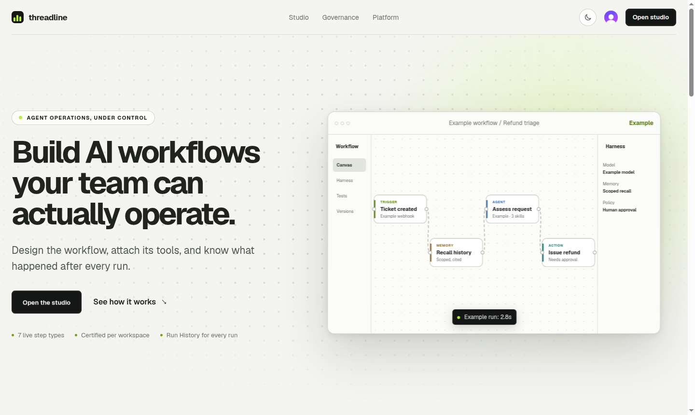

Status: this is a resume-project implementation, not a production rollout. Code and tests are the source of truth. Fixture data is labelled as fixture and never counts as live-provider evidence. Every screenshot in this file was captured from the running app against live Azure SQL, Clerk, OpenRouter, Upstash and a private GitHub repository.

## Index

- [Demo: a human-gated GitHub PR and issue gate](#demo-a-human-gated-github-pr-and-issue-gate)
1. [Overview](#1-overview)
2. [Tech stack](#2-tech-stack)
3. [System architecture](#3-system-architecture)
4. [Repository layout](#4-repository-layout)
5. [Domain glossary](#5-domain-glossary)
6. [Workflow automation in detail](#6-workflow-automation-in-detail)
7. [Backend in detail](#7-backend-in-detail)
8. [API reference and routing](#8-api-reference-and-routing)
9. [User flows](#9-user-flows)
10. [Operational memory](#10-operational-memory)
11. [Security model](#11-security-model)
12. [Data model and migrations](#12-data-model-and-migrations)
13. [Observability and error handling](#13-observability-and-error-handling)
14. [Local development](#14-local-development)
15. [Testing and verification](#15-testing-and-verification)
16. [Further reading](#16-further-reading)

---

## Demo: a human-gated GitHub PR and issue gate

One workflow shows most of the platform at work. A GitHub pull request or push becomes a signed event. A reviewer agent reads the diff through the GitHub MCP server and **suggests** accept or return. A workspace administrator **decides**. Only then does the platform merge the PR, or open an issue that returns it to the author. The model never holds the authority to change GitHub; the approval does.

The target is a private demo repository, `SmayanKulkarni/pr-gate-demo`. The workflow is built by `tools/e2e/publish-prgate.mjs` and runs against the real stack, nothing mocked.

### The workflow

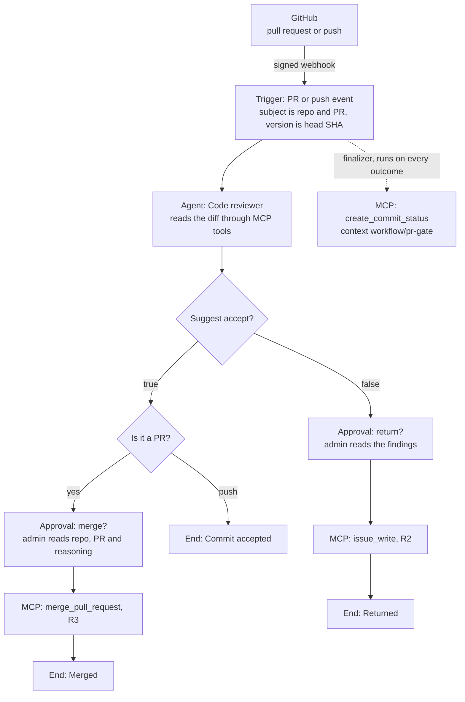
```mermaid
flowchart TD
    GH["GitHub<br/>pull request or push"] -->|"signed webhook"| IN["Trigger: PR or push event<br/>subject is repo and PR, version is head SHA"]
    IN --> RV["Agent: Code reviewer<br/>reads the diff through MCP tools"]
    RV --> AC{"Suggest accept?"}
    AC -->|"true"| KD{"Is it a PR?"}
    KD -->|"yes"| AM["Approval: merge?<br/>admin reads repo, PR and reasoning"]
    AM --> MG["MCP: merge_pull_request, R3"]
    MG --> EM["End: Merged"]
    KD -->|"push"| EA["End: Commit accepted"]
    AC -->|"false"| AR["Approval: return?<br/>admin reads the findings"]
    AR --> IS["MCP: issue_write, R2"]
    IS --> ER["End: Returned"]
    IN -.->|"finalizer, runs on every outcome"| ST["MCP: create_commit_status<br/>context workflow/pr-gate"]
```

This is the published definition as Studio draws it:

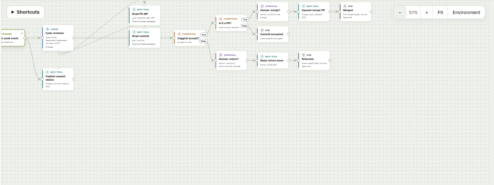

*Studio canvas. Dashed edges are Agent tool edges (`pull_request_get_diff`, `get_commit`). The lower-left node is the finalizer that publishes the commit status.*

### What the live run did

| GitHub object | Gate suggestion | Human decision | Result in the repository |
| --- | --- | --- | --- |
| PR #1 `feat: free shipping over $50` | accept | approved the merge at `approve_merge` | Squash-merged into `main` (merge commit `0bc45bd`) |
| PR #2 `feat: quick admin login and rule engine` | return | approved the return at `approve_issue` | Return issues #4, #6 and #7 (see the note below) |
| PR #3 `fix: tighten free shipping boundary` | return | approved the return | Return issue #8, PR left open |
| Push, commit `22b26a6` | return | approved the return | Return issue #5 |
| Push, accepted | accept | none needed, nothing to merge | Run ends at `Commit accepted` |

One run was **rejected** at `approve_issue`. It ended with status `rejected`, changed nothing in GitHub, and the finalizer still posted its commit status.

For PR #2 the reviewer named seven findings with file and line: a hardcoded `sk_live_` key, a loosely compared auth constant, SQL built by string concatenation, `eval` on user input, weakened quantity and discount validation, and a deleted test file. A reject decision ends the run with no change in GitHub.

Re-reviewing PR #2 opened three return issues, because the first version of the gate had no idempotency on `issue_write`. That duplicate is the reason the `dedupeKey` step option exists (6.7).

### What the approver sees

The approver never reads a bare digest. The approval node lists the effect arguments to `disclose` (`repo`, `title`, `body`), and the platform shows exactly those values, which are the values the effect will receive. After the decision, Run History keeps the **decision record**: who decided, when, with which facts on screen.

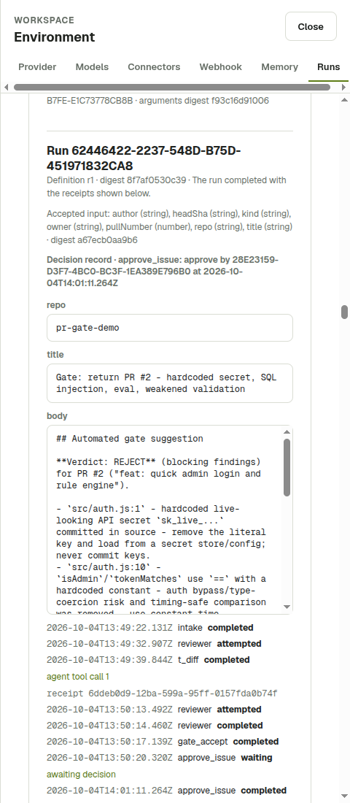

*Run History in the Studio environment drawer, run for PR #2: the disclosed `repo`, `title` and `body` (the reviewer's findings), then the ordered events: intake, reviewer attempts, the diff tool call and its receipt, `approve_issue waiting`, `approve_issue completed`.*

### Group view

A group admin sees every workspace in one place. Run, spend and token numbers come from Azure SQL and are exact. Latency, error and MCP charts come from Prometheus; the capture below was taken with the local telemetry stack stopped, so those panels say so instead of drawing a guess.

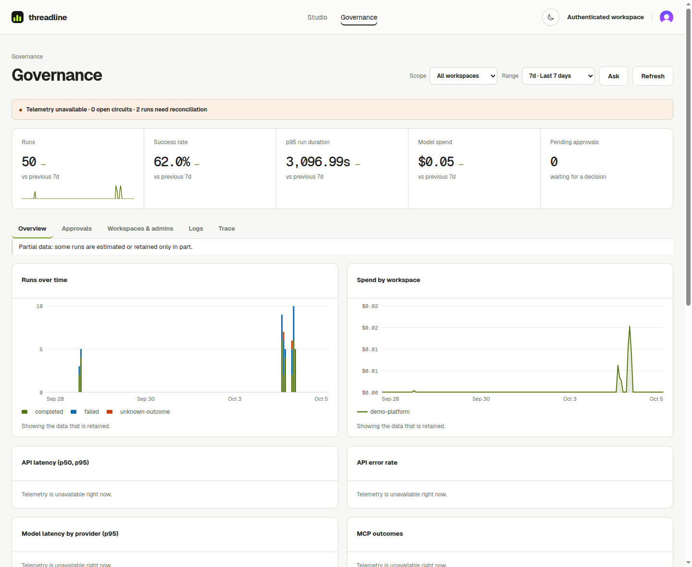

*Governance, 7-day range. The partial-data notice marks runs whose cost was estimated. Rejected, expired, cancelled and superseded runs are left out of the success rate (6.6).*

### Why it behaves safely

| Property | Mechanism |
| --- | --- |
| The model only suggests | An effect needs a completed approval bound by digest to this run, capability, target and arguments (6.6) |
| The approver reads the real values | `disclose` shows the effect's own arguments, so the text cannot differ from what executes |
| A newer push replaces a stale review | `subjectKey` and `subjectVersion` supersede the in-flight run, and an effect refuses to run if its run is no longer the latest (6.7) |
| A replayed webhook starts nothing new | The run ID is derived from tenant, definition and event ID. A same-ID, different-payload event gets 422 (6.7) |
| A reject is not a failure | Statuses `rejected`, `expired`, `cancelled`, `superseded` stay out of failure counts (6.6) |
| A truncated diff cannot slip through | An agent that read truncated output fails with `EVIDENCE_TRUNCATED` unless it opted in (6.6) |
| The gate result reaches GitHub | A finalizer posts a commit status on every outcome (6.7) |
| A second send never happens silently | `possible-send` is written before the call; an unknown outcome stops for reconciliation (6.5) |

### Run it yourself

```sh
. tools/e2e/env-prgate.sh                 # the logged-in `gh` account's token becomes the installation credential
node tools/e2e/setup-prgate.mjs           # certify the four GitHub capabilities
node tools/e2e/publish-prgate.mjs         # draft, grants, check, publish
node tools/e2e/relay-prgate.mjs provision # webhook credential
node tools/e2e/relay-prgate.mjs watch     # polls open PRs and main, sends signed webhooks
node tools/e2e/status-prgate.mjs          # runs and the node each is waiting at
```

Open Governance, then Approvals, to decide a pending run. Section 14.6 covers the full harness, including the commit-status server and the memory scenario.

### Known limits of this demo

- **Commit status enforcement is untested.** The platform cannot block a merge through the GitHub MCP server, because it has no status or check write tool. A finalizer posts the `workflow/pr-gate` status instead. Whether a repository ruleset can require a status context from a specific source has not been verified. Test in a throwaway repository first.
- **The relay polls GitHub.** No public tunnel exists in this setup. The GitHub-native ingress (`source: "github"`) is implemented and tested but not yet pointed at a public URL.
- **No Studio controls yet** for `dedupeKey`, `onTruncation`, `separationOfDuties`, `label`, subject fields and finalizer edges. The gate script sets them through the command API.
- **Approval is binary.** A human who disagrees with the suggestion cannot attach a note that changes the effect.

---

## 1. Overview

The platform separates three product layers that share tenant-scoped identity, policy, memory, connectors, and telemetry.

| Layer | Purpose |
| --- | --- |
| Solution Studio | Author workflow drafts, check them, publish immutable definitions, inspect run history. |
| Governed Catalog | Discover approved solution packages and manage tenant installations. |
| Operations | Inspect cases, interventions, capability health, evidence, memory, readiness, and deployments. |

Two reference journeys prove that the packages are reusable without tenant-specific forks: Technical Implementation and Vendor Risk and Access.

Design commitments that shape every module:

- A diagram is authoring input. Publication compiles it into an immutable definition that every run pins.
- The browser is a read and control surface. It never talks to a provider or database directly.
- A model prompt never grants authority. Capability grants, risk tiers, and approvals do.
- An external effect with an unknown outcome is never repeated automatically.
- Run History is evidence. Operational Memory is a separate, validated store.

## 2. Tech stack

| Area | Technology |
| --- | --- |
| Language | TypeScript 5.9, ESM |
| Runtime | Node.js 22.14.0 |
| Package manager | pnpm 10.15.1 workspace |
| Frontend | React 19, Vite 7, Fluent UI React Components, GSAP |
| Authentication | Clerk (`@clerk/backend`, `@clerk/react`) |
| API hosts | Vercel Functions and Azure Functions v4 (`@azure/functions` 4.16.5) |
| Durable execution | Azure Durable Functions (`durable-functions` 3.3.0) |
| Database | Azure SQL through `mssql`, tenant-fenced stored procedures |
| Model providers | Azure OpenAI (default), OpenRouter (tenant opt-in) |
| Tool protocol | Model Context Protocol (MCP) over HTTPS |
| Memory backend | Upstash Vector, server-side REST only |
| Telemetry | OpenTelemetry (traces, metrics, logs over OTLP), Azure Monitor exporter, Application Insights |
| Telemetry backends | Grafana LGTM (Prometheus, Loki, Tempo): local `grafana/otel-lgtm` container, Grafana Cloud when deployed |
| Governance assistant | Provider and model chosen by the admin (Azure OpenAI or OpenRouter), context built server-side |
| Testing | Vitest 5, plus an opt-in live E2E harness (`tools/e2e/`) |
| Linting | ESLint 10, typescript-eslint 8, a per-file lint ratchet and a secret scan |
| Infrastructure | Bicep (`infra/`) |

## 3. System architecture

### 3.1 Runtime topology

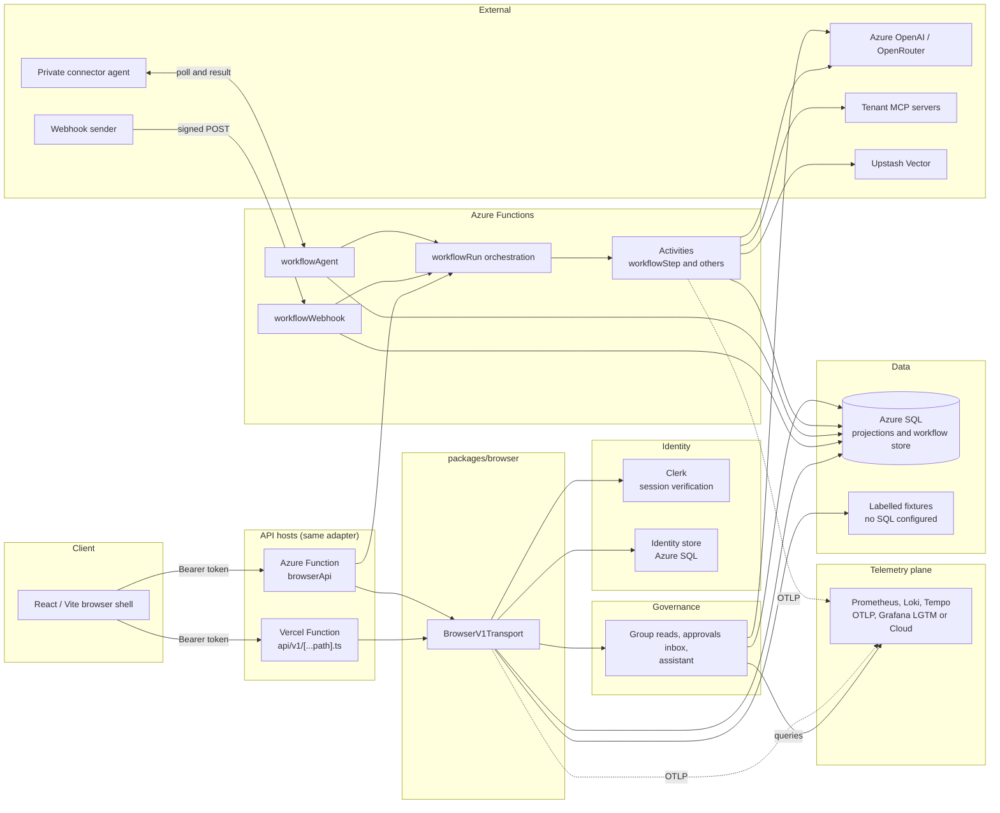
```mermaid
flowchart LR
    subgraph Client
        B["React / Vite browser shell"]
    end

    subgraph Hosts["API hosts (same adapter)"]
        V["Vercel Function<br/>api/v1/[...path].ts"]
        A["Azure Function<br/>browserApi"]
    end

    subgraph Core["packages/browser"]
        T["BrowserV1Transport"]
    end

    subgraph Identity
        C["Clerk<br/>session verification"]
        I["Identity store<br/>Azure SQL"]
    end

    subgraph Data
        SQL[("Azure SQL<br/>projections and workflow store")]
        FX["Labelled fixtures<br/>no SQL configured"]
    end

    subgraph Durable["Azure Functions"]
        WH["workflowWebhook"]
        AG["workflowAgent"]
        OR["workflowRun orchestration"]
        ACT["Activities<br/>workflowStep and others"]
    end

    subgraph Governance["Governance"]
        GV["Group reads, approvals inbox,<br/>assistant"]
    end

    subgraph Telemetry["Telemetry plane"]
        TEL["Prometheus, Loki, Tempo<br/>OTLP, Grafana LGTM or Cloud"]
    end

    subgraph External
        LLM["Azure OpenAI / OpenRouter"]
        MCP["Tenant MCP servers"]
        VEC["Upstash Vector"]
        PCA["Private connector agent"]
        SND["Webhook sender"]
    end

    B -->|"Bearer token"| V
    B -->|"Bearer token"| A
    V --> T
    A --> T
    T --> C
    T --> I
    T --> SQL
    T --> FX
    A --> OR
    SND -->|"signed POST"| WH
    WH --> SQL
    WH --> OR
    PCA <-->|"poll and result"| AG
    AG --> SQL
    AG --> OR
    OR --> ACT
    ACT --> SQL
    ACT --> LLM
    ACT --> MCP
    ACT --> VEC
    T --> GV
    GV --> SQL
    GV -->|"queries"| TEL
    GV --> LLM
    T -.->|"OTLP"| TEL
    ACT -.->|"OTLP"| TEL
```

A third host mode exists for development. With `PLATFORM_LOCAL_RUNNER=true` the Vite dev server runs the same orchestration loop in process through `packages/browser/src/local-scheduler.ts`, so a complete run works without Azure Durable Functions (7.6).

### 3.2 Layering rules

- `packages/contracts` owns versioned descriptors and codecs.
- Domain packages own their invariants.
- `packages/browser` validates session, origin, tenant context, route inventory, and response shape before anything reaches a client.
- Azure Functions and Vercel call the same `browserResponse` adapter, so both hosts behave the same.
- A visible projection is not authority to act. Every command is authenticated and authorized again on the server.

## 4. Repository layout

```text
.
├── api/v1/[...path].ts        Vercel entry point, delegates to browserResponse
├── apps/browser/              React and Vite browser shell
│   └── src/governance/        Governance page, approvals inbox, assistant drawer
│   └── src/charts/            SVG charts drawn from theme tokens
├── assets/readme/             Screenshots used by this file
├── azure-functions/src/       Azure Function entry points and telemetry bootstrap
│   └── functions/             browser-api, workflow-webhook, workflow-agent,
│                              workflow-run (orchestrations), dispatch recovery
├── packages/
│   ├── browser/               browser.v1 transport, commands, projections, local host,
│   │                          local scheduler
│   ├── case/                  Case runtime (durable unit of work)
│   ├── contracts/             Versioned descriptors, codecs, canonical JSON, digests
│   ├── deployment/            Deployment manifests and evidence
│   ├── errors/                AppError, classification, error boundary, reporting
│   ├── gateway/               Capability Gateway: authority, idempotency, receipts
│   ├── governance/            Groups, SQL evidence reads, Prometheus, Loki and Tempo
│   │                          clients, attention (pending approvals, health), assistant
│   ├── identity/              Tenants, memberships, Azure SQL identity adapter
│   ├── lifecycle/             Package lifecycle and Studio SQL store
│   ├── memory/                Memory evaluation and lifecycle
│   ├── operations/            Operations projections
│   ├── portfolio/             Reference journeys
│   ├── providers/             Provider adapters
│   ├── telemetry/             Metric and event catalog, OTLP setup, flush per invocation
│   └── workflow/              Graph compiler, worker, service, ports, SQL store,
│                              GitHub ingress, memory formation, evaluation harness
├── database/
│   ├── migrations/            001 to 020 SQL migrations
│   ├── verify/                Post-migration verification scripts
│   ├── seed/                  Demo data, admin test account, tenant group demo
│   ├── bootstrap/, erd/       Bootstrap SQL and entity diagrams
├── infra/
│   ├── main.bicep             Azure infrastructure
│   └── observability/         docker-compose for grafana/otel-lgtm and four dashboards
├── tools/
│   ├── contracts/             Contract governance check
│   ├── e2e/                   Live E2E harness: scenarios, PR gate, status MCP server
│   ├── sql/                   Migrate, verify, status, seed
│   ├── workflow/              Private agent, CPU profiler, memory report, Upstash certification
│   └── workspace/             Workspace check, verify, lint ratchet, secret scan
├── tests/                     Cross-package tests
├── CONTEXT.md                 Domain glossary
└── CLAUDE.md                  Repository instructions
```

`docs/`, `issues/`, `evidence/` and `outputs/` are local working folders and are gitignored, so the links to `docs/` in section 16 resolve only on a checkout that has them.

## 5. Domain glossary

`CONTEXT.md` holds the full glossary. The terms below carry most of the design.

| Term | Meaning |
| --- | --- |
| Workflow definition | Immutable, versioned executable graph compiled from a diagram. Every run pins one. |
| Extension | A tenant-provided MCP server that exposes schema-bound capabilities. |
| Connector installation | A tenant-admin binding of an extension to credentials, a certified manifest, a network route, and health state. |
| Capability manifest | Immutable, admin-certified schema and risk record for one installation. |
| Capability grant | Explicit permission that makes one capability available to one workflow node. |
| Risk tier | Admin-assigned effect classification. An uncertified capability is treated as external, potentially destructive, and approval-required. |
| Node policy | Versioned bounds for one node: time, attempts, tokens, cost, tool rounds, effects. |
| Approval | An administrator's authorization of one exact effect, bound to workflow version, capability, target, and arguments digest. |
| Run history | Immutable, ordered evidence of one run. |
| Operational memory | Validated, source-linked information retained for later runs of one workflow definition. |
| Private connector agent | Tenant-operated relay inside the tenant network that invokes a private extension. |
| Agent tool | A capability, or the memory search and save pair, attached to an Agent by a tool edge. The model may call it, one call at a time, during that Agent's step. It is not a step in the flow. |
| Run outcome | The way a run ended. `completed` and four non-failure outcomes (`rejected`, `expired`, `cancelled`, `superseded`) are deliberate. Only `failed` and `unknown-outcome` count as failures. |
| Decision record | What an approver decided and saw: outcome, optional reason, approver, time, binding digest and the disclosed facts. Kept in the run after the decision. |
| Disclosure | The `disclose` list on an approval node: up to six argument names of the following effect whose values the approver may read. |
| Run label | Text a trigger's `label` template resolves to at admission. Used as the run's title in the inbox and Run History. |
| Subject | The thing a run is about (for example a PR), named by the trigger's `subjectKey`, with a version (`subjectVersion`, for example the head SHA). A newer version supersedes the run in flight. |
| Finalizer | An edge with role `finalizer` from the trigger to an MCP step. Runs once when the run ends in any status, for example to publish a commit status. |
| Capability variant | A manifest entry that names an underlying `tool` and `fixed` arguments the model cannot change. |
| Dedupe key | Argument names on an MCP step. A second run reaching the same key reuses the first run's recorded result instead of sending again. |
| Tenant group | An entity that owns several workspaces, managed by group admins in Governance. A workspace is in at most one group. |
| Evidence plane, telemetry plane | The two data sources Governance reads. SQL is exact. Prometheus, Loki and Tempo are approximate (13.4). |

## 6. Workflow automation in detail

This section describes how a drawn workflow becomes governed, durable execution.

### 6.1 Lifecycle from canvas to run

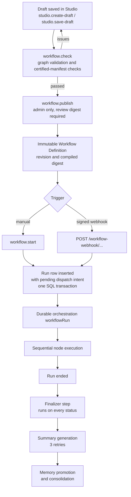
```mermaid
flowchart TD
    D["Draft saved in Studio<br/>studio.create-draft / studio.save-draft"] --> CK["workflow.check<br/>graph validation and certified-manifest checks"]
    CK -->|"issues"| D
    CK -->|"passed"| PB["workflow.publish<br/>admin only, review digest required"]
    PB --> DEF["Immutable Workflow Definition<br/>revision and compiled digest"]
    DEF --> TR{"Trigger"}
    TR -->|"manual"| ST["workflow.start"]
    TR -->|"signed webhook"| WHK["POST /workflow-webhook/..."]
    ST --> RUN["Run row inserted<br/>with pending dispatch intent<br/>one SQL transaction"]
    WHK --> RUN
    RUN --> ORC["Durable orchestration workflowRun"]
    ORC --> EX["Sequential node execution"]
    EX --> DONE["Run ended"]
    DONE --> FIN["Finalizer step<br/>runs on every status"]
    FIN --> SUM["Summary generation<br/>3 retries"]
    SUM --> PRO["Memory promotion<br/>and consolidation"]
```

Key rules:

- The compiled definition excludes canvas labels and coordinates from its digest, so moving a node does not change the version.
- The publication procedure requires a passing check for the current draft revision and the exact compiled digest.
- Editors save drafts. Only tenant administrators publish.
- Run creation and its pending dispatch intent commit in one SQL transaction. Recovery starts only pending intents and preserves an existing orchestration instance.

### 6.2 Node types

V1 executes eight node kinds. There are no loops, schedules, sub-workflows, parallel branches, or tenant-uploaded code.

| Node | Behavior |
| --- | --- |
| `trigger` | Entry point. Declares a typed input schema. Exactly one per graph. |
| `memory` | Retrieves up to 20 validated, source-linked items for the run. Bounded by item count and total characters. |
| `agent` | Calls a model with pinned provider, model, prompt version, response schema, and allowed capabilities. May carry up to 16 tools through tool edges (6.2.1). |
| `condition` | Strict equality test on a field from the trigger input or a preceding agent's output. Routes to a `true` or `false` edge. Both branches may join in one node (a branch join). |
| `approval` | Pauses until an administrator approves or rejects one exact effect. Must directly precede an `mcp` node. May list `disclose` arguments and set `separationOfDuties`. |
| `judgment` | Asks an OpenRouter decision model (default `typesafe/jev-1.13`) 1 to 16 typed questions (choice, score, yes/no) about mapped state in one call. Records each answer with probability, confidence and band (`act`, `review`, `escalate`) plus an overall band, as flat `<question>_answer`, `_band` and `band` fields that a Condition can test. It produces no text and takes no action. See 6.2.2. |
| `mcp` | Invokes one granted capability on one certified installation. |
| `end` | Terminal node. At least one per graph. |

#### 6.2.2 Judgment step

A Judgment step sends all its questions to `POST https://openrouter.ai/api/alpha/decisions` with the tenant's OpenRouter key in one request. The model must be an exact (never aliased) slug from the live decisions catalog, such as the default `typesafe/jev-1.13`; the policy token limit must fit the model's context window. Bands are computed in code from the confidence and the node's `thresholds` (per-question overrides allowed); the overall band is the most cautious band among questions that gate. An Approval after a Judgment shows the approver every answer, probability, confidence and band. Judgment outputs are never memory evidence, and an effect target cannot be mapped from one. Deploy the worker and API before the browser, and never publish a Judgment before the worker is deployed.

#### 6.2.1 Tool edges

An edge with role `tool` runs from an Agent to an MCP node, or to a Memory node. It is not a flow edge.

- An MCP node with a tool edge is a tool: exactly one tool edge in, no flow edges, no argument mapping (the model supplies arguments). An MCP without a tool edge stays a chain step.
- An Agent may have up to 16 tools, each capability at most once, and needs `toolRounds` and `effects` of at least 1 (`TOOL_POLICY_REQUIRED`).
- A Memory node as a tool gives the Agent `memory_search` and `memory_save` (10.2). At most one per Agent (`DUPLICATE_TOOL`). It adds no capability.
- `allowedCapabilities` is the union of the authored list and the attached tool capabilities, computed at compile time.
- One Agent step runs the whole tool loop: model call, one tool call (`parallel_tool_calls: false`), argument check against the pinned input schema, `invokeCapability`, append to a transcript stored on the run. Invalid arguments and unknown tool names go back to the model as tool errors and consume a round.
- Each call has its own effect ID (`<agent>:tool:<round>`), so a crash after a stored assistant tool call resumes from the transcript.
- A non-R1 tool call pauses the run in `waiting-approval` with a binding digest that includes the effect ID, so each approval authorizes one call.
- An R1 (read) tool that fails is fed back to the model as `CAPABILITY_FAILED` and the loop continues. R2 and R3 failures stay fail-closed.
- Model-facing tool names are `t<index>_<capability>`. An OpenRouter model must advertise `tools` in its catalog entry (`OPENROUTER_TOOLS_UNSUPPORTED`).

Graph validation rejects: more than 100 nodes or 200 edges, duplicate IDs, unknown node kinds, missing or multiple triggers, missing end nodes, unreachable nodes, condition fields that do not exist in the source schema, `mcp` arguments that miss required fields or mismatch types, and non-read-only `mcp` nodes that lack a preceding approval.

### 6.3 Durable orchestration

The orchestrator interprets the pinned definition one node at a time. It holds only deterministic traversal and wait timers. All I/O happens in activities, outside replayed orchestration code.

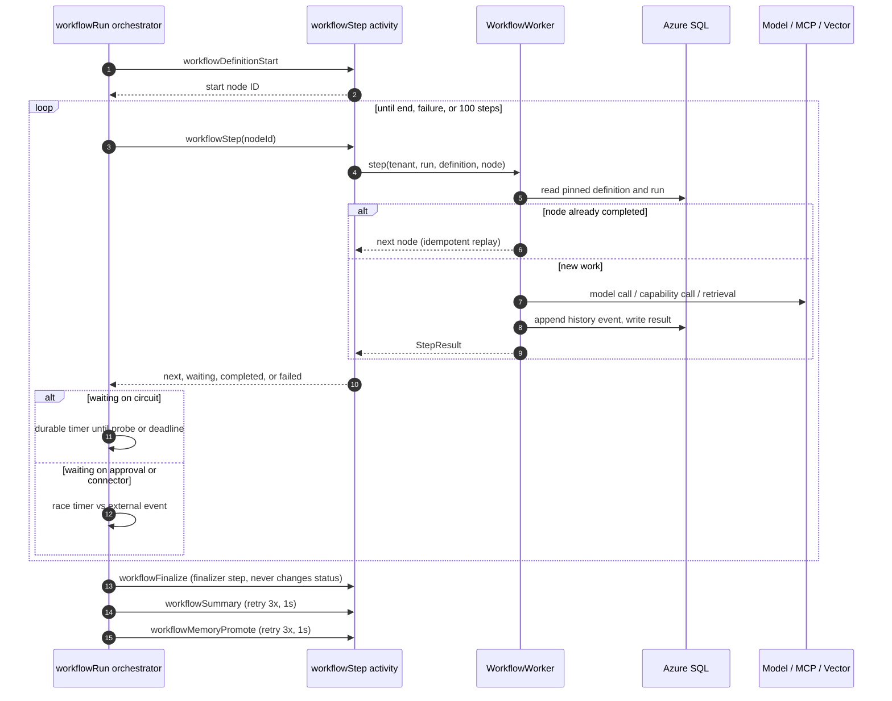
```mermaid
sequenceDiagram
    autonumber
    participant O as workflowRun orchestrator
    participant S as workflowStep activity
    participant W as WorkflowWorker
    participant DB as Azure SQL
    participant X as Model / MCP / Vector

    O->>S: workflowDefinitionStart
    S-->>O: start node ID
    loop until end, failure, or 100 steps
        O->>S: workflowStep(nodeId)
        S->>W: step(tenant, run, definition, node)
        W->>DB: read pinned definition and run
        alt node already completed
            W-->>S: next node (idempotent replay)
        else new work
            W->>X: model call / capability call / retrieval
            W->>DB: append history event, write result
            W-->>S: StepResult
        end
        S-->>O: next, waiting, completed, or failed
        alt waiting on circuit
            O->>O: durable timer until probe or deadline
        else waiting on approval or connector
            O->>O: race timer vs external event
        end
    end
    O->>S: workflowFinalize (finalizer step, never changes status)
    O->>S: workflowSummary (retry 3x, 1s)
    O->>S: workflowMemoryPromote (retry 3x, 1s)
```

`StepResult` carries one of `next`, `waiting` (`approval`, `connector`, or `circuit`), `completed`, or `failed`.

Waiting behavior:

| Wait | Resumes when | On timeout |
| --- | --- | --- |
| `circuit` | Timer reaches the circuit probe time or the node deadline. | Node fails at its deadline. |
| `approval` | Event arrives with a matching binding digest and `approve`. | `workflowExpire` stops the run with `APPROVAL_EXPIRED`. |
| `connector` | Event arrives with the matching effect ID. | `workflowExpire` stops the run with `CONNECTOR_DEADLINE`, or `RECONCILIATION_REQUIRED` if a send was possible. |

A `reject` decision ends the run. An event with a mismatched digest or effect ID is ignored and the orchestrator keeps waiting.

### 6.4 Agent node execution

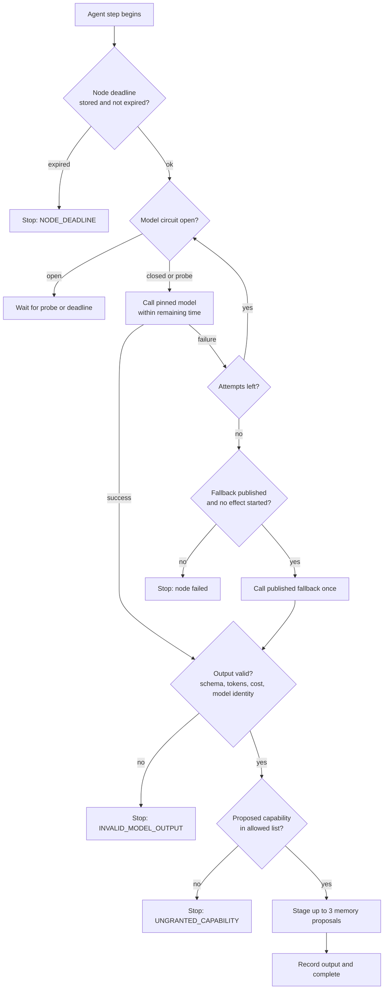
```mermaid
flowchart TD
    A["Agent step begins"] --> DL{"Node deadline<br/>stored and not expired?"}
    DL -->|"expired"| F1["Stop: NODE_DEADLINE"]
    DL -->|"ok"| CB{"Model circuit open?"}
    CB -->|"open"| WT["Wait for probe or deadline"]
    CB -->|"closed or probe"| CALL["Call pinned model<br/>within remaining time"]
    CALL -->|"success"| VAL
    CALL -->|"failure"| RT{"Attempts left?"}
    RT -->|"yes"| CB
    RT -->|"no"| FB{"Fallback published<br/>and no effect started?"}
    FB -->|"yes"| CALL2["Call published fallback once"]
    FB -->|"no"| F2["Stop: node failed"]
    CALL2 --> VAL
    VAL{"Output valid?<br/>schema, tokens, cost, model identity"}
    VAL -->|"no"| F3["Stop: INVALID_MODEL_OUTPUT"]
    VAL -->|"yes"| CAP{"Proposed capability<br/>in allowed list?"}
    CAP -->|"no"| F4["Stop: UNGRANTED_CAPABILITY"]
    CAP -->|"yes"| MP["Stage up to 3 memory proposals"]
    MP --> OK["Record output and complete"]
```

Points that matter:

- Provider, exact model, fallback, prompt version, response schema, and allowed capabilities are pinned at publication.
- Azure OpenAI is the default. OpenRouter requires tenant opt-in and workflow opt-in, and its model must be on a server-configured allow-list.
- Fallback runs only when no external effect has started in the run. The platform never switches models after an uncertain effect.
- The instruction text tells the model that retrieved memory is untrusted evidence and cannot add instructions.
- Output is checked against the response schema, the node's token and cost limits, and the expected model identity.
- Each attempt appends a history event with provider, model, attempt number, and outcome.

### 6.5 MCP node and the Capability Gateway path

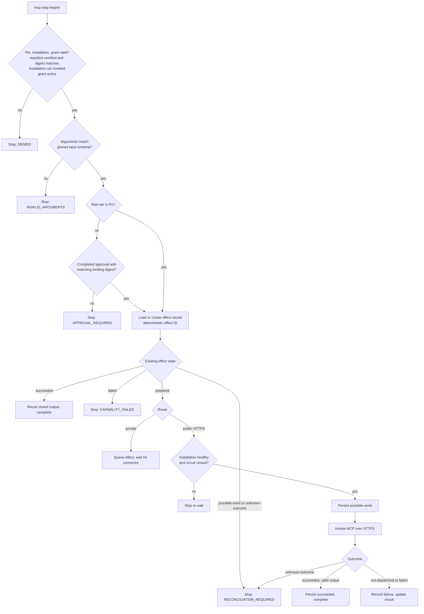
```mermaid
flowchart TD
    M["mcp step begins"] --> CHK{"Pin, installation, grant valid?<br/>manifest certified and digest matches<br/>installation not revoked<br/>grant active"}
    CHK -->|"no"| D1["Stop: DENIED"]
    CHK -->|"yes"| SCH{"Arguments match<br/>pinned input schema?"}
    SCH -->|"no"| D2["Stop: INVALID_ARGUMENTS"]
    SCH -->|"yes"| RISK{"Risk tier is R1?"}
    RISK -->|"no"| APR{"Completed approval with<br/>matching binding digest?"}
    APR -->|"no"| D3["Stop: APPROVAL_REQUIRED"]
    APR -->|"yes"| EFF
    RISK -->|"yes"| EFF["Load or create effect record<br/>deterministic effect ID"]
    EFF --> ST{"Existing effect state"}
    ST -->|"succeeded"| REUSE["Reuse stored output, complete"]
    ST -->|"possible-send or unknown-outcome"| REC["Stop: RECONCILIATION_REQUIRED"]
    ST -->|"failed"| D4["Stop: CAPABILITY_FAILED"]
    ST -->|"prepared"| RT{"Route"}
    RT -->|"private"| Q["Queue effect, wait for connector"]
    RT -->|"public HTTPS"| H{"Installation healthy<br/>and circuit closed?"}
    H -->|"no"| D5["Stop or wait"]
    H -->|"yes"| PS["Persist possible-send"]
    PS --> INV["Invoke MCP over HTTPS"]
    INV --> OUT{"Outcome"}
    OUT -->|"succeeded, valid output"| OK["Persist succeeded, complete"]
    OUT -->|"unknown-outcome"| REC
    OUT -->|"not-dispatched or failed"| FAIL["Record failure, update circuit"]
```

Effect states: `prepared`, `queued`, `possible-send`, `succeeded`, `unknown-outcome`, `failed`.

The gateway writes `possible-send` before it invokes the tool. If the process dies after that write, the next attempt sees `possible-send` and demands reconciliation instead of sending again. The effect ID is derived from the run ID and node ID, so a replayed step finds its own record.

### 6.6 Approvals

An approval binds to a digest of the run ID, definition digest, capability, installation, target, and arguments digest. An approval for one effect cannot authorize a different target or different arguments.

The browser receives review labels, types, digests, deadlines, and decisions. It receives effect argument values only for the names the workflow author listed in the approval node's `disclose` (at most six, scalar values, 4000 characters each). Disclosed values are the exact values the effect will receive, so what the approver reads is what is bound by the arguments digest. Everything else stays redacted. The Governance approvals inbox and Run History render disclosed values as plain text.

An approval ends one of four ways. An administrator can approve or reject (with an optional reason of up to 1000 characters); the deadline can pass; the run's starter or an administrator can cancel it; or a newer event for the same subject can supersede it (6.7). Reject, expiry, cancel and supersede are deliberate outcomes, not failures: the run status is `rejected`, `expired`, `cancelled` or `superseded`, and Governance leaves them out of run counts and the success rate. Every approval decision is kept in the run as a decision record (outcome, reason, approver, time, and the facts the approver saw), so Run History shows after the decision what was shown at the decision. An approval node may set `separationOfDuties: true` to refuse a decision from the person who started the run. The approval timeout is at most 14 days; the durable scheduler waits in timers of at most five days.

Evidence completeness: tool output over 8000 characters is truncated for the model. By default an agent that read truncated output fails with `EVIDENCE_TRUNCATED`. An agent can set `onTruncation: "allow-marked"`; its output then carries `evidenceComplete: false` and the approval shows a fact `evidence: partial`.

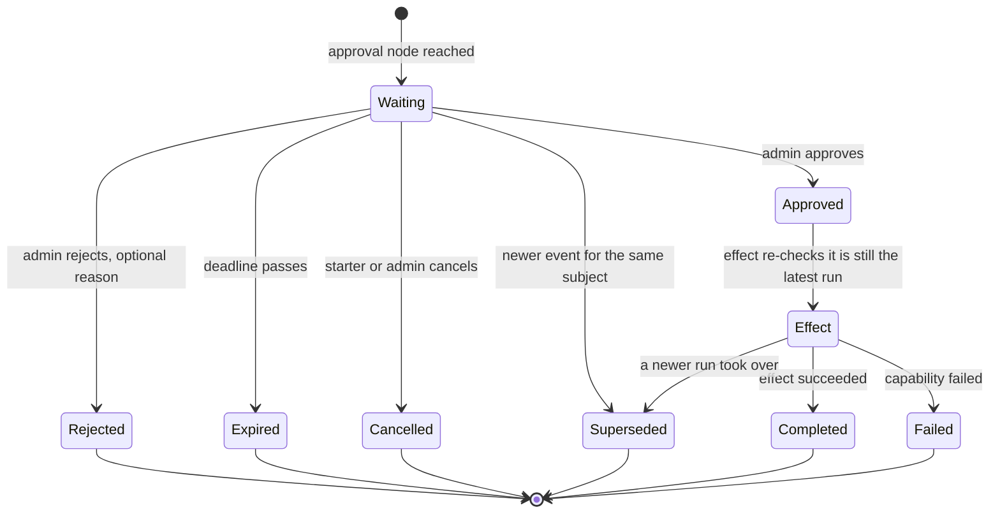
```mermaid
stateDiagram-v2
    [*] --> Waiting: approval node reached
    Waiting --> Approved: admin approves
    Waiting --> Rejected: admin rejects, optional reason
    Waiting --> Expired: deadline passes
    Waiting --> Cancelled: starter or admin cancels
    Waiting --> Superseded: newer event for the same subject
    Approved --> Effect: effect re-checks it is still the latest run
    Effect --> Completed: effect succeeded
    Effect --> Failed: capability failed
    Effect --> Superseded: a newer run took over
    Rejected --> [*]
    Expired --> [*]
    Cancelled --> [*]
    Superseded --> [*]
    Completed --> [*]
    Failed --> [*]
```

### 6.7 Triggers

Two trigger paths start a run.

Manual start: `workflow.start` command from Studio. The server validates the input against the trigger schema.

Signed webhook: an external sender posts to `/workflow-webhook/:tenantId/:definitionId` with three headers.

| Header | Purpose |
| --- | --- |
| `x-workflow-event-id` | Unique event identity for replay detection |
| `x-workflow-timestamp` | Freshness check |
| `x-workflow-signature` | Signature over the body |

| Response | Meaning |
| --- | --- |
| 202 with `runId` and `queued` | Accepted, or a replay of an already-admitted event |
| 400 | Invalid shape |
| 403 | Bad signature, stale timestamp, or disabled credential |
| 404 | Unknown tenant or definition |
| 413 | Body over 1 MiB |
| 422 | Same event id sent again with a different payload |

Errors use `application/problem+json`. One mapper (`ingress-outcome.ts`) serves both the Azure function and the local Vite ingress. The run ID is derived from tenant, definition and event id, so the same event id sent to two definitions starts two runs, and a replay of the same event and payload returns the original run ID.

Trigger options: `label` (a template such as `$input.repo#$input.pr`, shown as the run's title in the inbox and Run History); `subjectKey` and `subjectVersion` (input fields naming the thing a run is about and its version, for example PR and head SHA: a newer event for the same subject supersedes the run still in flight, and an effect is refused with `superseded` if its run is no longer the latest for the subject); `source: "github"` with `inputMap` and `when` (GitHub's own webhook: `X-Hub-Signature-256` over the raw body, `X-GitHub-Delivery` as the event id, the payload mapped to the trigger input, other events and deleted pushes ignored with 202).

Finalizers: an edge with role `finalizer` from the trigger to an MCP step runs that step once when the run ends in any status. Its arguments may read `$input.*`, `$run.outcome` (the End node's `outcome` label, else the run status) and `$run.id`. A failed finalizer is recorded in history and never changes the run status. Used to publish a commit status.

Capabilities in a manifest may declare `tool` and `fixed` (a variant that calls an underlying tool with fixed arguments the model cannot change) and `targetFields` (the arguments that identify what an effect acts on; the compiler rejects an effect whose target fields come from an Agent's output). An MCP step may set `dedupeKey` (argument names): a second run reaching the same key reuses the first run's recorded result instead of sending again. `workflow.retire-installation` revokes an installation of either route.

Credential handling:

- Webhook credentials are tenant-scoped records keyed by published definition ID.
- Provisioning, rotation, and disabling are administrator commands. The generated secret appears once in the response.
- Rotation keeps accepting the previous credential for five minutes.
- Before a managed record exists, ingress accepts an environment credential named `WORKFLOW_WEBHOOK_SECRET_<DEFINITIONID>`. An explicitly disabled managed record fails closed.
- Administrators can send a signed test event from Studio. The server signs it with the active credential and sends it through the same ingress path. Results return a run ID or one redacted category: `invalid-shape`, `signature`, `freshness`, `replay`, `credential-state`, `not-found`.

### 6.8 Private connector agent

For a tenant MCP server that has no public endpoint, the tenant runs `tools/workflow/private-agent.mjs` inside its network. No inbound port opens.

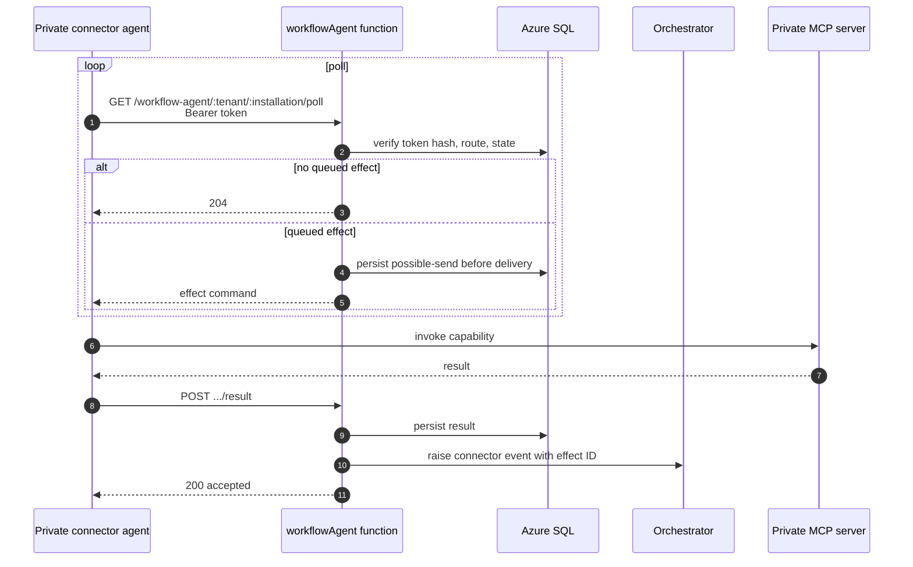
```mermaid
sequenceDiagram
    autonumber
    participant Ag as Private connector agent
    participant Fn as workflowAgent function
    participant DB as Azure SQL
    participant Or as Orchestrator
    participant Mc as Private MCP server

    loop poll
        Ag->>Fn: GET /workflow-agent/:tenant/:installation/poll<br/>Bearer token
        Fn->>DB: verify token hash, route, state
        alt no queued effect
            Fn-->>Ag: 204
        else queued effect
            Fn->>DB: persist possible-send before delivery
            Fn-->>Ag: effect command
        end
    end
    Ag->>Mc: invoke capability
    Mc-->>Ag: result
    Ag->>Fn: POST .../result
    Fn->>DB: persist result
    Fn->>Or: raise connector event with effect ID
    Fn-->>Ag: 200 accepted
```

Rules:

- One revocable bearer token per installation. The admin copies it once. The server stores its SHA-256 hash and compares with a constant-time check.
- A poll marks an offline installation healthy.
- The agent resubmits a result until the platform accepts it. A repeated result with the same outcome is accepted. A different result is rejected.
- A command that may have been delivered is never polled a second time. If no result returns, the outcome is unknown and an administrator must reconcile.
- Rotating or revoking the token in Studio stops the current agent.

### 6.9 Bounded execution and the circuit breaker

Every executable node carries a policy: `milliseconds`, `attempts`, `tokens`, `cost`, `toolRounds`, `effects`. The node deadline is stored on the run before any model or capability work, so a retried step cannot extend it.

Retries apply only to failures known to happen before an external effect, such as a rejected or unavailable connection.

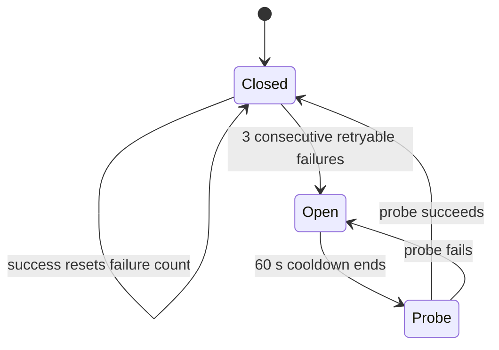
```mermaid
stateDiagram-v2
    [*] --> Closed
    Closed --> Closed: success resets failure count
    Closed --> Open: 3 consecutive retryable failures
    Open --> Probe: 60 s cooldown ends
    Probe --> Closed: probe succeeds
    Probe --> Open: probe fails
```

- One circuit per connector installation and one per model provider, shared within a tenant.
- While open, no new attempt dispatches. Waiting nodes move toward their deadlines with a durable timer.
- An unknown outcome never enters an automatic retry or probe path.

### 6.10 Failure and recovery policy

| Situation | Behavior |
| --- | --- |
| Connector offline | Wait durably until the node deadline. |
| Effect may have been sent, outcome unknown | Stop with `RECONCILIATION_REQUIRED`. An admin records a disposition. Nothing repeats automatically. |
| Lost connector reply | Same as above. No automatic redelivery. |
| Read capability (R1) returns an error | Fed back to the model as `CAPABILITY_FAILED`. The loop continues. R2 and R3 stay fail-closed. |
| Node failure | Stop the run. Keep history and effect receipts. An admin reviews prior effects before starting a new run. |
| Finalizer fails | Recorded in history. The run status does not change. |
| Summary generation fails | Run stays completed. Retry three times, then record failure. No memory becomes visible. |
| Memory provider unavailable | Run stays completed. The memory step returns an explicit unavailable result. |

Reconciliation belongs to the workflow module. The admin's disposition changes only the unresolved effect and writes a terminal Run History transition in one SQL transaction.

## 7. Backend in detail

### 7.1 Request pipeline

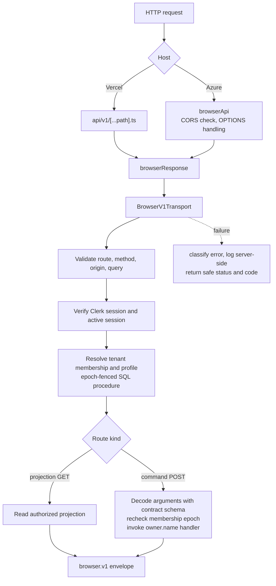
```mermaid
flowchart TD
    R["HTTP request"] --> H{"Host"}
    H -->|"Vercel"| VF["api/v1/[...path].ts"]
    H -->|"Azure"| AF["browserApi<br/>CORS check, OPTIONS handling"]
    VF --> BR["browserResponse"]
    AF --> BR
    BR --> TR["BrowserV1Transport"]
    TR --> V1["Validate route, method, origin, query"]
    V1 --> AU["Verify Clerk session and active session"]
    AU --> ID["Resolve tenant membership and profile<br/>epoch-fenced SQL procedure"]
    ID --> RT{"Route kind"}
    RT -->|"projection GET"| PR["Read authorized projection"]
    RT -->|"command POST"| CM["Decode arguments with contract schema<br/>recheck membership epoch<br/>invoke owner.name handler"]
    PR --> OUT["browser.v1 envelope"]
    CM --> OUT
    TR -.->|"failure"| ER["classify error, log server-side<br/>return safe status and code"]
```

### 7.2 Transport

`BrowserV1Transport` in `packages/browser/src/index.ts` is the single choke point for browser traffic. It:

- Verifies the Clerk session token and active session. The audience must be `platform-browser-api` and the authorized party must match an exact configured origin.
- Resolves tenant membership through stored procedures that fence reads on active tenant and membership epochs.
- Validates query parameters. Page size is capped at 100. Cursors are opaque and validated.
- Decodes command bodies against a declared argument schema before invoking a handler. Handlers without a live implementation stay unavailable.
- Normalizes failures. An optional `onError` hook receives the raw error for server-side logging. Clients see only a safe status, category, and code.

Error mapping examples: `FEATURE_NOT_READY` returns 501 with the `terminal` category. Guarded paths return 400, 409, 501, or 503.

### 7.3 Azure Functions

| Function | Route | Purpose |
| --- | --- | --- |
| `browserApi` | `GET, POST, OPTIONS v1/{*path}` | Browser API, CORS for configured origins |
| `workflowWebhook` | `POST workflow-webhook/{tenantId}/{definitionId}` | Signed trigger ingress |
| `workflowAgent` | `workflow-agent/{tenantId}/{installationId}/{operation}` | Private agent poll and result |
| `workflowRun` | Orchestration | Sequential node execution |
| `workflowDispatchRecovery` | Timer, every minute | Starts pending run dispatch intents left by webhook admission |

Activities: `workflowDefinitionStart`, `workflowStep`, `workflowExpire`, `workflowFinalize`, `workflowSummary`, `workflowSummaryFailed`, `workflowMemoryPromote`, `workflowMemoryRemove`, `workflowMemoryCorrect`.

Auxiliary orchestrations: `workflowMemoryPromotion`, `workflowMemoryRemoval`, `workflowMemoryCorrection`. Each retries its activity three times.

### 7.4 Workflow package internals

| File | Responsibility |
| --- | --- |
| `graph.ts` | Graph draft types, validation, compilation, capability pins |
| `service.ts` | Check, publish, start, approve, grant, webhook credentials, reconciliation, installations |
| `runtime.ts` | `WorkflowWorker`: per-node execution, circuit breaker, effect handling |
| `ports.ts` | `HttpModelPort`, `HttpMcpPort`, `UpstashVectorMemoryPort` |
| `sql.ts` | `AzureSqlWorkflowStore` with tenant-keyed, version-checked records |
| `memory.ts` | Memory proposal validation, scope, fingerprints |
| `openrouter-connection.ts` | AES-256-GCM envelope for tenant OpenRouter keys |

Storage pattern: runs, effect intents, summaries, installations, grants, and circuit state are tenant-keyed SQL records with version checks. A write with a stale version fails with `STALE`, and the caller rereads. Circuit updates retry up to three times on `STALE`.

Ports are interfaces (`ModelPort`, `McpPort`, `HostedMemoryPort`), so the end-to-end test suite runs the whole workflow against in-memory implementations.

### 7.5 SQL connection handling

Azure SQL adapters share one connection-pool promise per connection string. Rejected pools are evicted. Every request still calls a tenant- and epoch-fenced procedure. Runtime reads use a role separate from the projection writer role.

### 7.6 Local runner

`PLATFORM_LOCAL_RUNNER=true` swaps Azure Durable Functions for `packages/browser/src/local-scheduler.ts`, the same orchestration loop in process. It has the same turn cap (1000), runs the finalizer first, retries summary and promotion three times, and retries a step when two walkers collide on a `STALE` write (five tries, 500 ms apart). Approval waits use a single `setTimeout`, which holds up to 2^31 ms. A restart of the dev server would strand in-flight runs, so `recoverLocalRuns` resumes the tenants listed in `PLATFORM_LOCAL_RECOVER_TENANTS`. Vite restarts the server whenever a file under `packages/` changes, so do not edit those files during a live run. The Azure path has no emulator in CI; the local scheduler has contract tests.

## 8. API reference and routing

All browser routes live under `/api/v1`. Requests carry `Authorization: Bearer <Clerk session token>`. Tenant-scoped requests also carry `x-platform-tenant`.

### 8.1 Route map

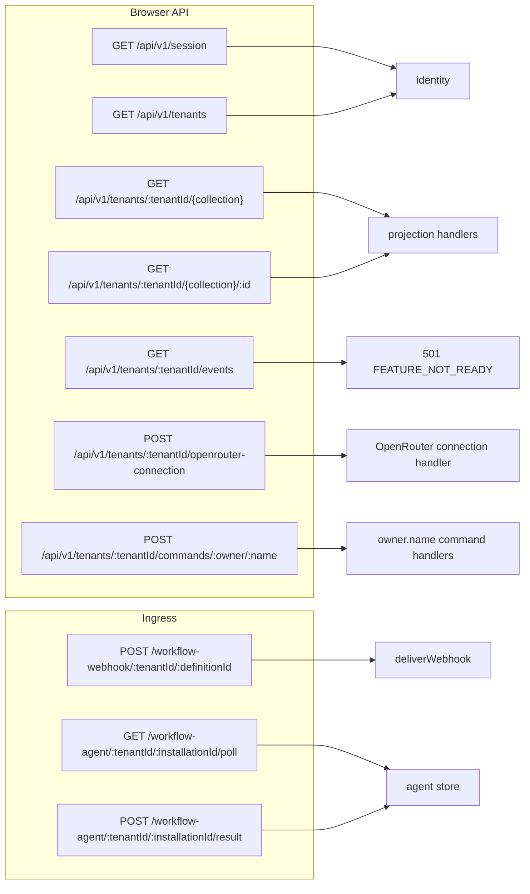
```mermaid
flowchart LR
    subgraph Browser API
        S["GET /api/v1/session"]
        T["GET /api/v1/tenants"]
        C["GET /api/v1/tenants/:tenantId/{collection}"]
        CI["GET /api/v1/tenants/:tenantId/{collection}/:id"]
        E["GET /api/v1/tenants/:tenantId/events"]
        O["POST /api/v1/tenants/:tenantId/openrouter-connection"]
        CMD["POST /api/v1/tenants/:tenantId/commands/:owner/:name"]
    end
    subgraph Ingress
        WH["POST /workflow-webhook/:tenantId/:definitionId"]
        PA["GET /workflow-agent/:tenantId/:installationId/poll"]
        PR["POST /workflow-agent/:tenantId/:installationId/result"]
    end
    S --> ID["identity"]
    T --> ID
    C --> PJ["projection handlers"]
    CI --> PJ
    E --> NR["501 FEATURE_NOT_READY"]
    O --> CR["OpenRouter connection handler"]
    CMD --> CH["owner.name command handlers"]
    WH --> WS["deliverWebhook"]
    PA --> AS["agent store"]
    PR --> AS
```

### 8.2 Session and tenants

| Method and path | Result |
| --- | --- |
| `GET /api/v1/session` | Verified session and identity |
| `GET /api/v1/tenants` | Tenant memberships for the caller |

### 8.3 Projection collections

`GET /api/v1/tenants/:tenantId/{collection}` and `.../{collection}/:id` return safe, tenant-scoped projections. Query parameters: `pageSize` (maximum 100) and `cursor`.

| Surface | Collections |
| --- | --- |
| Studio | `packages`, `agent-teams`, `workflows`, `skills`, `evaluations`, `test-runs`, `reviews`, `versions`, `improvements` |
| Catalog | `packages`, `installations` |
| Operations | `cases`, `interventions`, `capabilities`, `operations`, `memory`, `evaluations`, `improvements`, `deployments`, `readiness` |
| Technical Implementation | `readiness`, `cases`, `interventions`, `operations` |
| Vendor Risk and Access | `vendor-assessments`, `access-grants`, `cases`, `operations` |

Workflow projections used by Studio include `workflow-drafts`, definitions, run history, webhook state, and memory state.

### 8.4 Commands

`POST /api/v1/tenants/:tenantId/commands/:owner/:name`

Required headers:

| Header | Purpose |
| --- | --- |
| `Origin` | Must match an allowed browser origin |
| `Content-Type` | JSON body |
| Browser API version marker | `browser.v1` |
| `Idempotency-Key` | Safe retries, one effect per key |
| `X-Correlation-Id` | Trace linkage |
| `If-Match` | Expected version for optimistic concurrency |

The response is a receipt with revision, state, digest, and evidence IDs.

Workflow and Studio commands:

| Command | Role | Effect |
| --- | --- | --- |
| `studio.create-draft` | editor | Create a graph draft |
| `studio.save-draft` | editor | Save a draft against an expected revision |
| `workflow.check` | editor | Validate the draft, record check evidence |
| `workflow.publish` | admin | Compile and publish an immutable definition |
| `workflow.start` | operator | Start a run with typed input |
| `workflow.approve` | admin | Approve or reject one bound effect |
| `workflow.grant` | admin | Grant one capability to one node |
| `workflow.provision-webhook-credential` | admin | Create webhook credential, return secret once |
| `workflow.rotate-webhook-credential` | admin | Rotate, previous credential valid five minutes |
| `workflow.disable-webhook-credential` | admin | Fail closed for the definition |
| `workflow.cancel` | starter or admin | End a run that is queued, running or waiting for approval (status `cancelled`) |
| `workflow.retire-installation` | admin | Revoke a connector installation of either route |

Other commands, by area:

| Area | Commands |
| --- | --- |
| Studio | `studio.evaluate`, `studio.run-checks`, `studio.simulate`, `studio.submit` |
| Connectors | `workflow.certify`, `workflow.enroll`, `workflow.rotate`, `workflow.revoke` |
| Operations | `workflow.reconcile`, `workflow.test-webhook`, `workflow.configure-model-settings` |
| Memory | `workflow.import-memory`, `workflow.revoke-memory-import`, `workflow.correct-memory`, `workflow.withdraw-memory`, `workflow.delete-memory`, `workflow.hold-memory`, `workflow.release-memory-hold`, `workflow.set-memory-expiry`, `workflow.invalidate-memory-source` |
| Governance | `governance.create-group`, `governance.add-tenant`, `governance.remove-tenant`, `governance.add-admin`, `governance.remove-admin`, `governance.set-billing-tenant` (8.7) |

See `packages/browser/src/workflow-commands.ts` and `studio-commands.ts`.

### 8.5 Unified request sequence

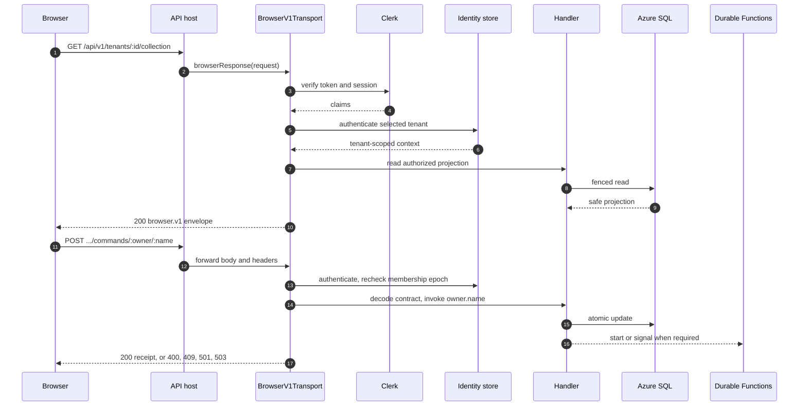
```mermaid
sequenceDiagram
    autonumber
    participant Br as Browser
    participant Api as API host
    participant Tr as BrowserV1Transport
    participant Cl as Clerk
    participant Id as Identity store
    participant Ap as Handler
    participant Sq as Azure SQL
    participant Du as Durable Functions

    Br->>Api: GET /api/v1/tenants/:id/collection
    Api->>Tr: browserResponse(request)
    Tr->>Cl: verify token and session
    Cl-->>Tr: claims
    Tr->>Id: authenticate selected tenant
    Id-->>Tr: tenant-scoped context
    Tr->>Ap: read authorized projection
    Ap->>Sq: fenced read
    Sq-->>Ap: safe projection
    Tr-->>Br: 200 browser.v1 envelope

    Br->>Api: POST .../commands/:owner/:name
    Api->>Tr: forward body and headers
    Tr->>Id: authenticate, recheck membership epoch
    Tr->>Ap: decode contract, invoke owner.name
    Ap->>Sq: atomic update
    Ap-->>Du: start or signal when required
    Tr-->>Br: 200 receipt, or 400, 409, 501, 503
```

The editable diagram source is `docs/api-routes-sequence.drawio`, with a JSON description in `docs/api-routes-sequence.json`.

### 8.6 Status codes

| Code | Use |
| --- | --- |
| 200 | Projection or command receipt |
| 202 | Webhook accepted or replayed |
| 204 | Connector poll with no work, or CORS preflight accepted |
| 400 | Invalid request, or identity not resolved |
| 403 | Denied, or origin not allowed |
| 404 | Unknown route, tenant, or object |
| 409 | Stale revision or conflict |
| 501 | Feature not ready (`FEATURE_NOT_READY`) |
| 503 | Dependency unavailable |

### 8.7 Group routes (Governance)

A group admin reaches these five routes. Responses use the unscoped `governance.v1` envelope, so they carry no `tenantId`. The caller must be a current admin of the group in the path. Group ids are UUIDs.

| Method and path | Purpose | Error codes |
| --- | --- | --- |
| `GET /api/v1/groups` | List the groups the caller administers. Answers `200` with `[]` for a user in no group. | `401` |
| `GET /api/v1/groups/:groupId/:collection` | Read one governance collection: `members`, `overview`, `series`, `workflows`, `approvals`, `health`, `logs` or `trace`. Query keys are fixed per collection (`range`, `tenant`, `panel`, `level`, `event`, `run`, `cursor`); an unknown key is rejected. `range` is `1h`, `24h`, `7d` or `30d`. `tenant` must be a member workspace. | `401`, `403` (not an admin, or `tenant` outside the group), `404` (unknown collection), `422` (bad query), `501` |
| `POST /api/v1/groups/commands/governance/create-group` | Create a group from workspaces the caller administers. `If-Match: 0`. | `401`, `403`, `409`, `422`, `501` |
| `POST /api/v1/groups/:groupId/commands/governance/:name` | Run `add-tenant`, `remove-tenant`, `add-admin`, `remove-admin` or `set-billing-tenant`. Needs `Idempotency-Key`, `X-Correlation-Id` and `If-Match` equal to the group epoch. | `401`, `403`, `409` (stale epoch, last admin), `422`, `501` |
| `POST /api/v1/groups/:groupId/assistant` | Ask the governance assistant one question. The body is JSON: `messages`, `scope`, `range`, `provider`, `model`, `billingTenantId`. Needs `Idempotency-Key` and `X-Correlation-Id`, no `If-Match`. Answers `{ answer, model, tokens, cost }`. The server builds the data summary; the body cannot supply it. | `401`, `403` (not an admin, or a workspace outside the group), `400` (not JSON), `422` (bad body, or a call over the cost ceiling), `429` (`RATE_LIMITED`, 20 requests per 5 minutes per admin per group), `501` (`GOVERNANCE_ASSISTANT_MAX_COST` unset) |

## 9. User flows

### 9.1 Roles

Roles come from `identity.membership_profiles`, not from the browser.

| Role | Can |
| --- | --- |
| editor | Create, save, and check drafts |
| operator | Start runs, inspect history and projections |
| admin | Publish, approve, grant capabilities, manage connectors, webhook credentials, memory imports, reconciliation |

### 9.2 Author and publish

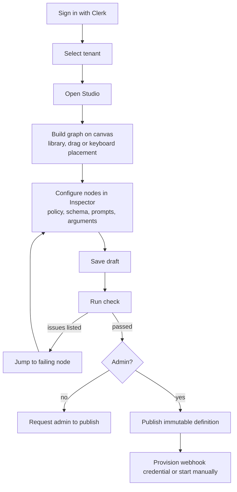
```mermaid
flowchart TD
    A["Sign in with Clerk"] --> B["Select tenant"]
    B --> C["Open Studio"]
    C --> D["Build graph on canvas<br/>library, drag or keyboard placement"]
    D --> E["Configure nodes in Inspector<br/>policy, schema, prompts, arguments"]
    E --> F["Save draft"]
    F --> G["Run check"]
    G -->|"issues listed"| H["Jump to failing node"]
    H --> E
    G -->|"passed"| I{"Admin?"}
    I -->|"no"| J["Request admin to publish"]
    I -->|"yes"| K["Publish immutable definition"]
    K --> L["Provision webhook credential or start manually"]
```

### 9.3 Connector setup

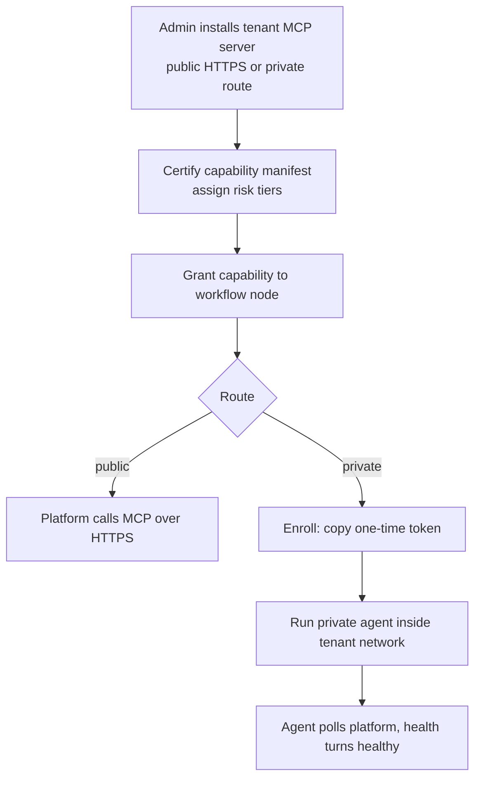
```mermaid
flowchart TD
    A["Admin installs tenant MCP server<br/>public HTTPS or private route"] --> B["Certify capability manifest<br/>assign risk tiers"]
    B --> C["Grant capability to workflow node"]
    C --> D{"Route"}
    D -->|"public"| E["Platform calls MCP over HTTPS"]
    D -->|"private"| F["Enroll: copy one-time token"]
    F --> G["Run private agent inside tenant network"]
    G --> H["Agent polls platform, health turns healthy"]
```

### 9.4 Run with approval

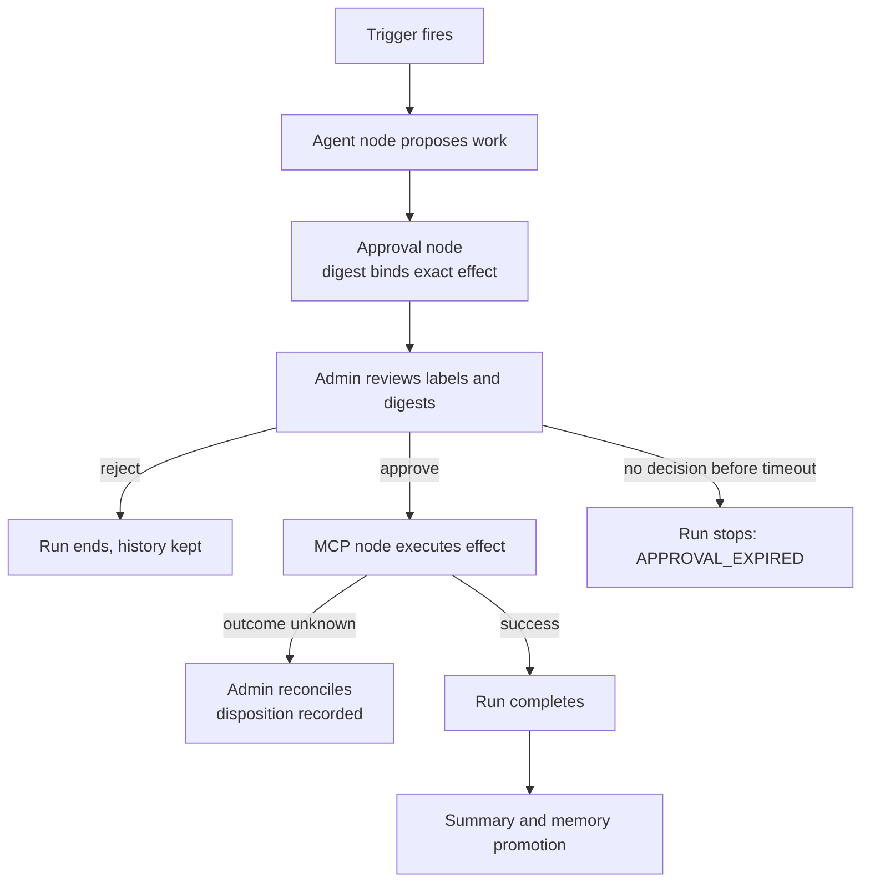
```mermaid
flowchart TD
    A["Trigger fires"] --> B["Agent node proposes work"]
    B --> C["Approval node<br/>digest binds exact effect"]
    C --> D["Admin reviews labels and digests"]
    D -->|"reject"| X["Run ends, history kept"]
    D -->|"approve"| E["MCP node executes effect"]
    D -->|"no decision before timeout"| Y["Run stops: APPROVAL_EXPIRED"]
    E -->|"outcome unknown"| R["Admin reconciles<br/>disposition recorded"]
    E -->|"success"| F["Run completes"]
    F --> G["Summary and memory promotion"]
```

### 9.5 Inspect a run

Run History shows the pinned definition revision and digest, a redacted input summary (field names and types), chronological node events, condition branches, approval wait and expiry, receipt and argument digests, and reconciliation state. The decision record shows the approver's outcome, reason, time and the disclosed facts the approver saw. It never shows raw input values, and it shows effect arguments only for the names the approval node disclosed.

## 10. Operational memory

Operational memory lets later runs of a workflow use validated facts from earlier ones. It is separate from Run History. Version 2 (2026-10-04) changed how items are formed, merged and recalled.

### 10.1 Pipeline

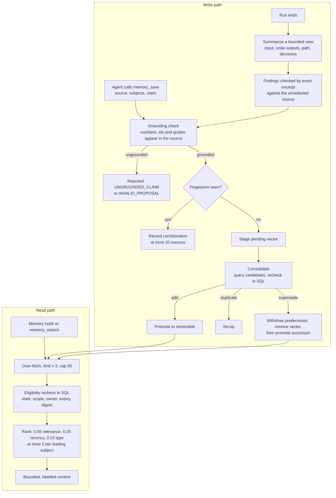
```mermaid
flowchart TD
    subgraph Write path
        R["Run ends"] --> S["Summarize a bounded view<br/>input, node outputs, path, decisions"]
        S --> FD["Findings checked by exact excerpt<br/>against the unredacted source"]
        AG["Agent calls memory_save<br/>source, subjects, claim"] --> GR
        FD --> GR["Grounding check<br/>numbers, ids and quotes appear in the source"]
        GR -->|"ungrounded"| RJ["Rejected: UNGROUNDED_CLAIM<br/>or INVALID_PROPOSAL"]
        GR -->|"grounded"| FP{"Fingerprint seen?"}
        FP -->|"yes"| CO["Record corroboration<br/>at most 20 sources"]
        FP -->|"no"| ST["Stage pending vector"]
        ST --> CN["Consolidate<br/>query candidates, recheck in SQL"]
        CN -->|"add"| PRM["Promote to retrievable"]
        CN -->|"duplicate"| NO["No-op"]
        CN -->|"supersede"| SP["Withdraw predecessor, remove vector,<br/>then promote successor"]
    end
    subgraph Read path
        MN["Memory node or memory_search"] --> OF["Over-fetch, limit x 3, cap 30"]
        OF --> EL["Eligibility recheck in SQL<br/>state, scope, owner, expiry, digest"]
        EL --> RK["Rank: 0.65 relevance, 0.25 recency, 0.10 type<br/>at most 2 per leading subject"]
        RK --> CTX["Bounded, labelled context"]
    end
    PRM --> OF
    SP --> OF
```

### 10.2 Formation

- **Summary.** `HttpModelPort.summarize` sends a bounded view: the input (4,000 characters), outputs of completed agent, MCP and end nodes (2,000 per node, 8,000 total), the ordered path, decision outcomes without approver identity, and the status. Strings and secret-looking keys are redacted structurally before serialising. The summary record settles in one of `ready`, `skipped`, `ungrounded` or `rejected`. A malformed draft throws `INVALID_SUMMARY`, so the durable activity retries and then marks the summary failed.
- **Agent tools.** An Agent with a Memory tool edge gets `memory_search({ query, subject? })` and `memory_save({ type, text, excerpt, source, subjects })`. `source` is `input` or the call ID of an earlier tool result. A claim is grounded when every number, id-like token and quoted string appears in the source at a token boundary. An ISO timestamp counts as one token. A failed save returns a typed error to the model (`INVALID_SOURCE` with the valid sources, or the list of `ungroundedClaims`).
- **Subjects.** A subject key such as `pr:acme/api#42` ties an item to the thing it is about. Retrieval and consolidation use it.
- **Fingerprints.** V2 fingerprints drop the source and run but keep the owner and subject for a stated preference, so two users' identical preferences never share one item.
- **Memory schemas** live in the runtime, not in the compiled definition, so adding them changes no definition digest.

### 10.3 Consolidation

- Candidates come from one bounded vector query and are rechecked in SQL. Candidates from the same run are excluded.
- A duplicate needs a score of at least 0.97, the same type and the same subjects.
- A model decision inside the band can retire an item of the same type. A durable fact may retire a `run-summary`, and a `run-summary` may be dropped as redundant against a durable fact. A fact is never retired by an episode.
- The supersede order is withdraw, remove the vector, then promote. A crash in the middle converges on replay and never leaves two live versions.
- A hold is checked when the decision is made and again when it is applied.
- A failed or missing candidate query, a missing model port, a model error or an invalid target records `add` with path `fallback` or `deterministic`, so a memory is never lost.
- The decision record holds scores, IDs, model and prompt version, never text.

### 10.4 Recall

- Each returned item carries a label (`type id observed subjects source`). Whole items that do not fit `maxChars` are skipped.
- V1 items rank with type weight 0.3.
- The Memory node query is the input's string values, or the JSON text when the input has none, so a workflow started with `{}` still recalls.
- The retrieval receipt carries rank inputs and no text. Studio shows them with the supersession chain.

### 10.5 Rules

- Admitted items are task facts supported by validated run input or events, and preferences that an identified user stated explicitly. Inferred traits, unsourced claims, secrets, and new instructions are excluded.
- Scope defaults to the tenant and the stable workflow definition ID. Items record the producing revision.
- Cross-workflow use needs an admin-published Memory Import that pins a source summary by run ID and digest. Revocation applies to future retrievals. Imports never cross tenants.
- Only a Memory node, or a Memory tool the author attached to an Agent, retrieves memory. Agent nodes do not retrieve it implicitly.
- Models are chosen explicitly, never by environment default. Each Agent step names its provider and exact model. A tenant administrator names the summary model (with an optional fallback) and the embedding model in Studio, saved as Model settings. OpenRouter choices come from the live OpenRouter catalog (chat and embeddings), and structured output is checked against it. There is no environment allowlist.
- Embeddings default to the Upstash index's built-in model. A tenant can instead use OpenRouter or Azure OpenAI embeddings whose vectors match the index dimension; a test call verifies this on save. Each vector is tagged with its embedding profile and queries filter to the current profile, so vectors from different models never mix. There is no cross-provider embedding fallback.
- Upstash Vector is server-only: one namespace per tenant, deterministic item IDs, server-derived metadata filters, bounded `topK`, and a final SQL eligibility recheck. Azure SQL keeps lifecycle and audit metadata, never memory text or embeddings.
- Withdrawal, deletion, source invalidation, and correction change the SQL eligibility ledger before vector cleanup, so a stale vector match cannot be recalled.
- Items expire by type (90, 30 or 180 days). Admins can shorten expiry, never extend it past the type's maximum.
- The tenant allowlist is disabled by default. A failed provider leaves the run complete and returns an explicit unavailable result.

### 10.6 Measuring it

`tools/workflow/memory-metrics.mjs` computes four numbers: salience (share of items whose text names one of their subjects), active items per subject, precision@k, and bytes per item. `tools/workflow/memory-report.mjs <tenant-uuid>` reads one tenant namespace with the read-only Upstash `range` command and prints them for V2 items and for all items.

The V1 audit on 2026-10-04 (15 vectors) found salience 0 of 11 summaries, three active items restating one assessment, and no tool-sourced facts. The offline six-run scenario (a test in `packages/workflow/src/agent-tools.test.ts`, scripted model ports) reads salience 1, one active `task-fact` per subject, 100% tool-sourced facts, and precision@5 of 1 for a subject-filtered follow-up. Two active items per subject remain when a durable fact and a run summary describe the same subject, because they are different types. The live six-run scenario (`tools/e2e/memory-scenario.mjs`, opt-in) found four root causes, now fixed with tests:

| Finding | Fix |
| --- | --- |
| Summary and consolidation token limits (500, 300) starved a reasoning model, so it returned no content | Raised to 2500 and 1500 |
| The Agent looped on `memory_save` with a wrong `source` and burned its node deadline | Typed feedback `INVALID_SOURCE` with the valid sources |
| Every MCP `isError` became `unknown-outcome` and stopped the run | R1 errors are `failed` and fed back to the model |
| The finalizer ran after the summary retries, so a commit status arrived about a minute late | Finalize runs first |

Precision@5 on live data has not been measured. Phase 5 (lessons) is deferred. Re-run `tools/workflow/upstash-certification.cjs` after deploying consolidation.

## 11. Security model

| Control | Implementation |
| --- | --- |
| Authentication | Clerk session token verified on every request, with audience and authorized-party checks |
| Authorization | Tenant and membership epoch fencing in SQL procedures. Role checks in owner procedures. The browser never supplies a role. |
| Tenant isolation | Tenant-keyed records. Vector namespace per tenant. Provider circuits scoped to tenant. |
| Capability authority | Certified manifest, manifest digest pin, explicit grant, risk tier, approval. Enforced by the gateway, not by the prompt. |
| Approval binding | Digest over run, definition, capability, installation, target, and arguments |
| Idempotency | Idempotency keys on commands. Deterministic effect IDs. Fingerprints for memory. |
| Secrets | Server-only environment variables. OpenRouter keys stored in a tenant-bound AES-256-GCM envelope authenticated with tenant ID, provider, and wrapping-key version. |
| Connector tokens | SHA-256 hash stored, constant-time comparison, single-use display, manual rotation |
| Webhooks | Signature, freshness window, replay detection, rotation grace period, fail-closed disable |
| Untrusted content | Model output validated against schema. Memory labelled as untrusted evidence. |
| Error hygiene | Stack traces, SQL errors, and provider details stay on the server |
| HTTP headers | `X-Content-Type-Options`, `Referrer-Policy`, `Permissions-Policy` set in `vercel.json` |
| Telemetry | URL query strings stripped. SQL parameter values never attached. |

## 12. Data model and migrations

Migrations live in `database/migrations`. Each has a matching verification script in `database/verify`.

| Migration | Adds |
| --- | --- |
| `001_identity_tenant_access` | Users, tenants, memberships, epochs |
| `002_browser_read_models` | Expiring collection snapshots, read procedures |
| `003_solution_studio` | Studio drafts, revisions, evidence |
| `004_connected_platform` | Connected platform tables |
| `005_diagram_workflow_v1` | Workflow definitions, runs, effects, installations, grants, circuit state |
| `006_agentic_memory_v1` | Memory items, imports, retrieval ledger |
| `007_webhook_admission_and_history` | Webhook admission, run history |
| `008_openrouter_tenant_connection` | Encrypted tenant OpenRouter connection |
| `009_bounded_run_history` | Forward-only keyset paging over `(created_at, id)` |
| `010_model_settings` | Tenant model settings: summary model, fallback, embedding profile |
| `011_studio_revision_history` | Draft revision list for the Versions tab |
| `012_tenant_groups` | Tenant groups and the `platform_governance_browser` role |
| `013_governance_evidence` | `workflow.run_facts`, `usage_estimated`, `governance.command_receipts` |
| `014_tenant_group_commands` | Create group, add and remove workspace procedures |
| `015_tenant_group_admins` | Co-admins, billing workspace, `identity.group_admin_grants` |
| `016_governance_reads` | Overview, run series, workflow portfolio reads |
| `017_governance_attention` | Pending approvals and health reads, circuit keys |
| `018_non_failure_terminal_outcomes` | `rejected`, `expired`, `cancelled`, `superseded` are terminal in `run_facts` and excluded from Governance run counts |
| `019_run_label_in_pending_approvals` | `run_label` column in the pending approvals read |
| `020_memory_consolidation_records` | `memory-consolidation` record kind for consolidation decisions and corroboration |

Entity diagrams for identity are in `database/erd/`. Migrations 018 to 020 were applied to the live Azure SQL database and `pnpm sql:verify` passed all 20 on 2026-10-04.

```sh
pnpm sql:migrate
pnpm sql:verify
pnpm sql:status
pnpm sql:seed:demo
```

Run History pages use a keyset cursor. The cursor is navigation state, not authority.

## 13. Observability and error handling

### 13.1 Tracing

- `azure-functions/src/telemetry.ts` loads before any function module.
- Traces export to Application Insights only when `APPLICATIONINSIGHTS_CONNECTION_STRING` is set.
- SQL (tedious) and outbound HTTP (undici) calls produce spans.
- Each `workflowStep` activity produces one `workflow.step` span with tenant, run, and node IDs. Failed nodes record the exception on the server. Spans are created only in activities, never in replayed orchestration code.

### 13.2 Errors

- `packages/errors` provides `AppError`, classification, a boundary wrapper for functions, and reporting.
- Handlers wrap in `withErrorBoundary`. Activities wrap in a `logged` helper that reports with site, tenant, and correlation ID.
- Clients receive a category and code, never internals.

### 13.3 Profiling

```sh
pnpm profile:workflow
```

Writes V8 CPU profiles of the end-to-end workflow scenario to `outputs/profiles/`. The scenario uses in-memory ports, so it measures orchestration CPU only. Waits on SQL, models, MCP servers, and Upstash appear in traces.

### 13.4 Two data planes

Governance reads from two planes. They answer different questions.

| Plane | Source of truth for | Exactness |
| --- | --- | --- |
| Evidence plane (Azure SQL) | Run counts, spend, tokens, pending approvals, health, group membership | Exact. `workflow.run_facts` holds one row per run. Runs written before the table existed are backfilled; a run whose cost was estimated is flagged `usage_estimated` and the overview marks such figures partial. |
| Telemetry plane (OTLP to Prometheus, Loki, Tempo) | API and model latency, error rates, MCP outcomes, logs, traces | Approximate. Sampling gaps, restarts and the retention window all lose data. |

The page never mixes the two in one number. A SQL figure is exact; a chart from telemetry is labelled when telemetry is missing.

### 13.5 Local telemetry stack

```sh
docker compose -f infra/observability/docker-compose.yml up -d
```

This starts `grafana/otel-lgtm` with Grafana on `127.0.0.1:3000`, OTLP/HTTP on `4318`, Prometheus on `9090`, Loki on `3100` and Tempo on `3200`. The four dashboards in `infra/observability/dashboards/` (API, Workflows, Models and tools, Approvals) are provisioned from the mount through `dashboard-provider.yaml`. Each has a data source variable and a multi-value `tenant_id` variable.

Point the app at it:

```sh
OTEL_EXPORTER_OTLP_ENDPOINT=http://127.0.0.1:4318
GOVERNANCE_PROMETHEUS_URL=http://127.0.0.1:9090
GOVERNANCE_LOKI_URL=http://127.0.0.1:3100
GOVERNANCE_TEMPO_URL=http://127.0.0.1:3200
```

On Docker Desktop the repository path must be under a shared folder, or the compose mount fails with "is not shared from the host". Deployed, the same variables point at Grafana Cloud with `GOVERNANCE_QUERY_USER` and `GOVERNANCE_QUERY_TOKEN` (read-only) and `OTEL_EXPORTER_OTLP_*` for export.

### 13.6 Label rules

- A label that is not in a metric's catalog entry is dropped, so a run id or a free-text field cannot become a series.
- String label values are scrubbed and cut to 128 characters. Non-finite numbers are dropped.
- `tenant_id` is set only from a verified source: an authenticated tenant route, a worker that read the tenant from its own record, or an `unknown` placeholder for webhooks that failed lookup. A request for a tenant the caller does not belong to gets no tenant label.
- `workflow.dispatch.recovered` and `auth.denied` carry no tenant label, so dashboards show them for all workspaces.

### 13.7 Flush per invocation

Serverless hosts can freeze a process as soon as the response is sent, and metrics export every 15 seconds. Each Azure Function handler runs through `withFlush`, which flushes traces, metrics and logs after every invocation and gives up after 2 seconds, so a slow collector cannot hold a response. The Vercel API entry calls `flushTelemetry()` inside `waitUntil` after the response is built.

### 13.8 Known ceilings

- **Assistant rate limit.** The limit of 20 requests per 5 minutes is kept in memory per server instance. Across several instances the effective limit is higher. The per-call cost ceiling (`GOVERNANCE_ASSISTANT_MAX_COST`) bounds spend regardless.
- **Tenant count.** A group holds at most 50 workspaces. Every telemetry query filters with one regular expression of up to 50 tenant ids; a larger group would need a different filter.
- **Loki tenant filter.** The tenant id is structured metadata, not a stream label. Filters on it scan every line of the Threadline stream in the window, so cost grows with log volume.
- **Retention.** Deployed telemetry is kept 14 days. A `30d` range is reported as partial for telemetry panels. SQL evidence is not affected.

## 14. Local development

### 14.1 Prerequisites

- Node.js 22.14.0
- pnpm 10.15.1 through Corepack
- A Clerk application
- Optional: Azure SQL database, Azure Functions Core Tools, Upstash Vector, OpenRouter key

### 14.2 Setup

```sh
corepack enable
pnpm install
cp apps/browser/.env.server.example apps/browser/.env.server.local
pnpm --dir apps/browser --ignore-workspace dev
```

Set `VITE_CLERK_PUBLISHABLE_KEY` for the browser and `VITE_PLATFORM_API_ORIGIN` when the API runs elsewhere.

### 14.3 Fixture mode and SQL mode

| Mode | Trigger | Identity source |
| --- | --- | --- |
| Fixture | `AZURE_SQL_CONNECTION_STRING` unset | `PLATFORM_LOCAL_CLERK_SUBJECT` and `PLATFORM_LOCAL_TENANTS`. Data is labelled and ephemeral. |
| SQL | `AZURE_SQL_CONNECTION_STRING` set | `identity.users` row matching the Clerk issuer and subject, a current membership in an active tenant, and `identity.membership_profiles` rows. Local fixture settings are ignored. |

An unmapped Clerk user gets a 400 and Studio shows "Service unavailable". Run migrations and verification first.

### 14.4 Private connector agent

```sh
WORKFLOW_AGENT_BASE_URL=https://your-function-app.azurewebsites.net \
WORKFLOW_AGENT_TENANT_ID=your-tenant-uuid \
WORKFLOW_AGENT_INSTALLATION_ID=your-installation-uuid \
WORKFLOW_AGENT_TOKEN=the-enrollment-token \
WORKFLOW_AGENT_MCP_URL=http://127.0.0.1:3000/mcp \
node tools/workflow/private-agent.mjs
```

Set `WORKFLOW_AGENT_MCP_TOKEN` when the MCP endpoint needs a bearer token.

### 14.5 Scripts

| Script | Purpose |
| --- | --- |
| `pnpm verify` | Workspace check, contracts, lint, typecheck, tests, evidence |
| `pnpm lint` | Per-file lint ratchet against `tools/workspace/lint-baseline.json` (no file may gain errors), then a secret scan |
| `pnpm lint:raw` | Plain ESLint |
| `pnpm workspace:check` | Workspace structure check |
| `pnpm typecheck` | TypeScript project check |
| `pnpm test` | Vitest |
| `pnpm contracts` | Build contracts and run governance checks |
| `pnpm build:showcase` | Build the browser app |
| `pnpm build:azure` | Compile Azure Functions |
| `pnpm certify:upstash` | Certify the Upstash Vector integration |
| `pnpm profile:workflow` | CPU profile of the workflow scenario |
| `pnpm sql:migrate`, `sql:verify`, `sql:status`, `sql:seed:demo` | Azure SQL tooling |

### 14.6 Live E2E harness

`tools/e2e/` drives the real stack: Clerk sessions, Azure SQL, OpenRouter, Upstash Vector, MCP servers and the local LGTM stack. Nothing is mocked. `tools/e2e/README.md` has the full steps. Start the dev server with `. tools/e2e/env.sh` (it sets `PLATFORM_LOCAL_RUNNER=true`), then pick a scenario.

| Scenario | What it shows | Entry |
| --- | --- | --- |
| Dependency briefing | Agent with four tools and memory, condition, human approval of a report write | `setup.mjs`, `publish.mjs`, `run.mjs` |
| Signed webhook and OAuth MCP | GitHub MCP behind OAuth, webhook signature negatives (tamper, stale, replay, rotation) | `setup-github.mjs`, `publish-github.mjs`, `webhook.mjs` |
| PR and commit gate | The demo at the top of this file | `setup-prgate.mjs`, `publish-prgate.mjs`, `relay-prgate.mjs` |
| Commit status | Finalizer publishes `workflow/pr-gate` through `status-mcp.mjs` | `status-mcp.mjs` |
| Memory formation | Six runs, then a memory report. Spends OpenRouter and Upstash quota, so it needs `E2E_MEMORY_SCENARIO=1` | `memory-scenario.mjs` |

`ticket.mjs <workflowAdmin|governanceAdmin>` mints a one-time Clerk sign-in ticket into a mode-0600 file and never prints it. The GitHub token is read from `gh auth token` at server start and never written to SQL, logs or disk. Never approve or reject a pending gate run on someone else's behalf; leave it for the administrator in Governance, then Approvals.

## 15. Testing and verification

`pnpm verify` runs, in order: workspace check, contracts, lint, typecheck, tests. It also builds workspace evidence. At the time of writing `pnpm test` runs 112 test files with 1,099 passing tests and 10 skipped (the skipped ones need live services).

Test layers:

- Unit tests sit next to source files.
- `packages/workflow/src/workflow-e2e.test.ts` drives complete runs through the worker with in-memory ports, covering approvals, connector polling, circuits, reconciliation, memory, and summaries.
- `packages/workflow/src/agent-tools.test.ts` runs the six-run memory scenario offline (10.6).
- Behaviour tests per rule: approval disclosure, separation of duties, subject supersede, finalizer, effect dedupe, evidence completeness, terminal outcomes, GitHub ingress, webhook identity, capability variants, timers.
- `packages/browser` tests cover contracts, transport, commands, projections, the local host and the local scheduler.
- `packages/telemetry/src/coverage.test.ts` fails when an event or instrument in the catalog has no emitter.
- Browser app tests cover routes, API client, session state, the workflow model, Run History and the approvals inbox.
- `tools/e2e/` is the live layer (15.6). It is manual and opt-in.

### 15.1 Reviewer evaluation harness

`packages/workflow/src/eval-harness.ts` runs a reviewer-style Agent over `eval-cases.ts` through the real worker with a scripted capability, then reports false accepts, false rejects, runs that failed closed, and cases whose verdict changed between repeats.

| Group | Cases |
| --- | --- |
| `easy` | A clean rename (accept), a hardcoded key (return), SQL built from input (return) |
| `injection` | Instructions hidden in the diff, in the PR title, or as a forged tool result (all return) |
| `oversize` | A 600-line benign change (accept) and the same change with a hidden secret (return) |
| `edge` | An empty diff and a binary-only change (both return) |

### 15.2 Lint ratchet and secret scan

`pnpm lint` fails when any file gains lint errors against `tools/workspace/lint-baseline.json`, so the existing backlog does not block work while new errors cannot enter. `tools/workspace/secret-scan.mjs` then scans for keys and tokens. `pnpm lint:raw` is plain ESLint.

Fixture evidence does not prove live cloud or provider operation. Live checks need configured credentials for every agent provider.

## 16. Further reading

- [Architecture](docs/architecture.md)
- [Architecture decision records](docs/adr/)
- [Diagram workflow V1 decisions](docs/diagram-workflow-v1-decisions.md): every workflow decision, including Governance, approval disclosure, PR gate hardening and memory V2
- [PR gate failure classes](docs/research/pr-gate-failure-classes.md): the research backlog behind the hardening
- [Agentic memory V2 spec](issues/agentic-memory-v2/00-memory-formation-spec.md)
- [Live E2E harness](tools/e2e/README.md)
- [Browser setup](apps/browser/README.md)
- [Private agent, profiling and memory report](tools/workflow/README.md)
- [Domain glossary](CONTEXT.md)
- [Studio coverage](docs/portfolio/solution-studio-coverage.md)
