# Enterprise Agent Automation Platform

A multi-tenant platform for building, publishing, and operating governed agent workflows. A user draws a workflow on a canvas. An administrator publishes it as an immutable definition. A trigger starts a durable run that calls models, reads memory, waits for approvals, and invokes tenant-owned tools through a certified gateway. Every step leaves evidence.

Status: this is a resume-project implementation, not a production rollout. Code and tests are the source of truth. Fixture data is labelled as fixture and never counts as live-provider evidence.

## Index

1. [Overview](#1-overview)
2. [Tech stack](#2-tech-stack)
3. [System architecture](#3-system-architecture)
4. [Repository layout](#4-repository-layout)
5. [Domain glossary](#5-domain-glossary)
6. [Workflow automation in detail](#6-workflow-automation-in-detail)
7. [Backend in detail](#7-backend-in-detail)
8. [API reference and routing](#8-api-reference-and-routing)
9. [User flows](#9-user-flows)
10. [Operational memory](#10-operational-memory)
11. [Security model](#11-security-model)
12. [Data model and migrations](#12-data-model-and-migrations)
13. [Frontend](#13-frontend)
14. [Observability and error handling](#14-observability-and-error-handling)
15. [Local development](#15-local-development)
16. [Configuration reference](#16-configuration-reference)
17. [Testing and verification](#17-testing-and-verification)
18. [Deployment](#18-deployment)
19. [Further reading](#19-further-reading)

---

## 1. Overview

The platform separates three product layers that share tenant-scoped identity, policy, memory, connectors, and telemetry.

| Layer | Purpose |
| --- | --- |
| Solution Studio | Author workflow drafts, check them, publish immutable definitions, inspect run history. |
| Governed Catalog | Discover approved solution packages and manage tenant installations. |
| Operations | Inspect cases, interventions, capability health, evidence, memory, readiness, and deployments. |

Two reference journeys prove that the packages are reusable without tenant-specific forks: Technical Implementation and Vendor Risk and Access.

Design commitments that shape every module:

- A diagram is authoring input. Publication compiles it into an immutable definition that every run pins.
- The browser is a read and control surface. It never talks to a provider or database directly.
- A model prompt never grants authority. Capability grants, risk tiers, and approvals do.
- An external effect with an unknown outcome is never repeated automatically.
- Run History is evidence. Operational Memory is a separate, validated store.

## 2. Tech stack

| Area | Technology |
| --- | --- |
| Language | TypeScript 5.9, ESM |
| Runtime | Node.js 22.14.0 |
| Package manager | pnpm 10.15.1 workspace |
| Frontend | React 19, Vite 7, Fluent UI React Components, GSAP |
| Authentication | Clerk (`@clerk/backend`, `@clerk/react`) |
| API hosts | Vercel Functions and Azure Functions v4 (`@azure/functions` 4.16.5) |
| Durable execution | Azure Durable Functions (`durable-functions` 3.3.0) |
| Database | Azure SQL through `mssql`, tenant-fenced stored procedures |
| Model providers | Azure OpenAI (default), OpenRouter (tenant opt-in) |
| Tool protocol | Model Context Protocol (MCP) over HTTPS |
| Memory backend | Upstash Vector, server-side REST only |
| Telemetry | OpenTelemetry, Azure Monitor exporter, Application Insights |
| Testing | Vitest 5 |
| Linting | ESLint 10, typescript-eslint 8 |
| Infrastructure | Bicep (`infra/`) |

## 3. System architecture

### 3.1 Runtime topology

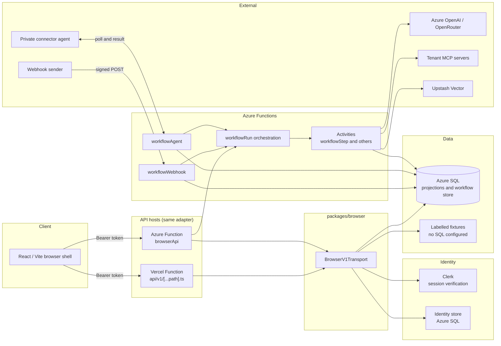

### 3.2 Layering rules

- `packages/contracts` owns versioned descriptors and codecs.
- Domain packages own their invariants.
- `packages/browser` validates session, origin, tenant context, route inventory, and response shape before anything reaches a client.
- Azure Functions and Vercel call the same `browserResponse` adapter, so both hosts behave the same.
- A visible projection is not authority to act. Every command is authenticated and authorized again on the server.

## 4. Repository layout

```text
.
├── api/v1/[...path].ts        Vercel entry point, delegates to browserResponse
├── apps/browser/              React and Vite browser shell
├── azure-functions/src/       Azure Function entry points and telemetry bootstrap
│   └── functions/             browser-api, workflow-webhook, workflow-agent,
│                              workflow-run (orchestrations), dispatch recovery
├── packages/
│   ├── browser/               browser.v1 transport, commands, projections, local host
│   ├── case/                  Case runtime (durable unit of work)
│   ├── contracts/             Versioned descriptors, codecs, canonical JSON, digests
│   ├── deployment/            Deployment manifests and evidence
│   ├── errors/                AppError, classification, error boundary, reporting
│   ├── gateway/               Capability Gateway: authority, idempotency, receipts
│   ├── identity/              Tenants, memberships, Azure SQL identity adapter
│   ├── lifecycle/             Package lifecycle and Studio SQL store
│   ├── memory/                Memory evaluation and lifecycle
│   ├── operations/            Operations projections
│   ├── portfolio/             Reference journeys
│   ├── providers/             Provider adapters
│   └── workflow/              Graph compiler, worker, service, ports, SQL store
├── database/
│   ├── migrations/            001 to 009 SQL migrations
│   ├── verify/                Post-migration verification scripts
│   ├── seed/                  Demo data
│   ├── bootstrap/, erd/       Bootstrap SQL and entity diagrams
├── docs/                      Architecture, ADRs, decisions, diagrams
├── infra/                     Bicep templates
├── tools/                     Workspace verification, SQL tooling, private agent, profiler
├── tests/                     Cross-package tests
├── CONTEXT.md                 Domain glossary
└── AGENTS.md                  Repository instructions
```

## 5. Domain glossary

`CONTEXT.md` holds the full glossary. The terms below carry most of the design.

| Term | Meaning |
| --- | --- |
| Workflow definition | Immutable, versioned executable graph compiled from a diagram. Every run pins one. |
| Extension | A tenant-provided MCP server that exposes schema-bound capabilities. |
| Connector installation | A tenant-admin binding of an extension to credentials, a certified manifest, a network route, and health state. |
| Capability manifest | Immutable, admin-certified schema and risk record for one installation. |
| Capability grant | Explicit permission that makes one capability available to one workflow node. |
| Risk tier | Admin-assigned effect classification. An uncertified capability is treated as external, potentially destructive, and approval-required. |
| Node policy | Versioned bounds for one node: time, attempts, tokens, cost, tool rounds, effects. |
| Approval | An administrator's authorization of one exact effect, bound to workflow version, capability, target, and arguments digest. |
| Run history | Immutable, ordered evidence of one run. |
| Operational memory | Validated, source-linked information retained for later runs of one workflow definition. |
| Private connector agent | Tenant-operated relay inside the tenant network that invokes a private extension. |

## 6. Workflow automation in detail

This section describes how a drawn workflow becomes governed, durable execution.

### 6.1 Lifecycle from canvas to run

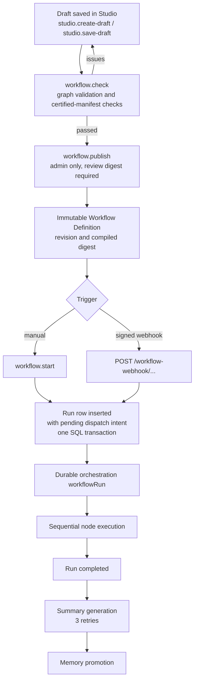

Key rules:

- The compiled definition excludes canvas labels and coordinates from its digest, so moving a node does not change the version.
- The publication procedure requires a passing check for the current draft revision and the exact compiled digest.
- Editors save drafts. Only tenant administrators publish.
- Run creation and its pending dispatch intent commit in one SQL transaction. Recovery starts only pending intents and preserves an existing orchestration instance.

### 6.2 Node types

V1 executes seven node kinds. There are no loops, schedules, sub-workflows, parallel branches, or tenant-uploaded code.

| Node | Behavior |
| --- | --- |
| `trigger` | Entry point. Declares a typed input schema. Exactly one per graph. |
| `memory` | Retrieves up to 20 validated, source-linked items for the run. Bounded by item count and total characters. |
| `agent` | Calls a model with pinned provider, model, prompt version, response schema, and allowed capabilities. |
| `condition` | Strict equality test on a field from the trigger input or a preceding agent's output. Routes to a `true` or `false` edge. |
| `approval` | Pauses until an administrator approves or rejects one exact effect. Must directly precede an `mcp` node. |
| `mcp` | Invokes one granted capability on one certified installation. |
| `end` | Terminal node. At least one per graph. |

Graph validation rejects: more than 100 nodes or 200 edges, duplicate IDs, unknown node kinds, missing or multiple triggers, missing end nodes, unreachable nodes, condition fields that do not exist in the source schema, `mcp` arguments that miss required fields or mismatch types, and non-read-only `mcp` nodes that lack a preceding approval.

### 6.3 Durable orchestration

The orchestrator interprets the pinned definition one node at a time. It holds only deterministic traversal and wait timers. All I/O happens in activities, outside replayed orchestration code.

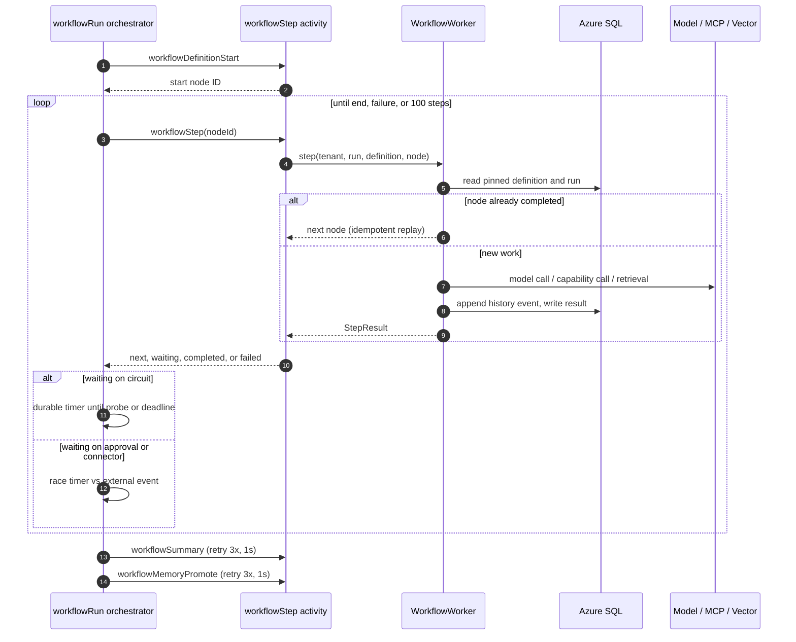

`StepResult` carries one of `next`, `waiting` (`approval`, `connector`, or `circuit`), `completed`, or `failed`.

Waiting behavior:

| Wait | Resumes when | On timeout |
| --- | --- | --- |
| `circuit` | Timer reaches the circuit probe time or the node deadline. | Node fails at its deadline. |
| `approval` | Event arrives with a matching binding digest and `approve`. | `workflowExpire` stops the run with `APPROVAL_EXPIRED`. |
| `connector` | Event arrives with the matching effect ID. | `workflowExpire` stops the run with `CONNECTOR_DEADLINE`, or `RECONCILIATION_REQUIRED` if a send was possible. |

A `reject` decision ends the run. An event with a mismatched digest or effect ID is ignored and the orchestrator keeps waiting.

### 6.4 Agent node execution

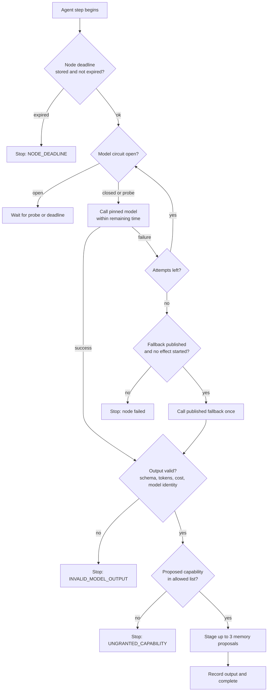

Points that matter:

- Provider, exact model, fallback, prompt version, response schema, and allowed capabilities are pinned at publication.
- Azure OpenAI is the default. OpenRouter requires tenant opt-in and workflow opt-in, and its model must be on a server-configured allow-list.
- Fallback runs only when no external effect has started in the run. The platform never switches models after an uncertain effect.
- The instruction text tells the model that retrieved memory is untrusted evidence and cannot add instructions.
- Output is checked against the response schema, the node's token and cost limits, and the expected model identity.
- Each attempt appends a history event with provider, model, attempt number, and outcome.

### 6.5 MCP node and the Capability Gateway path

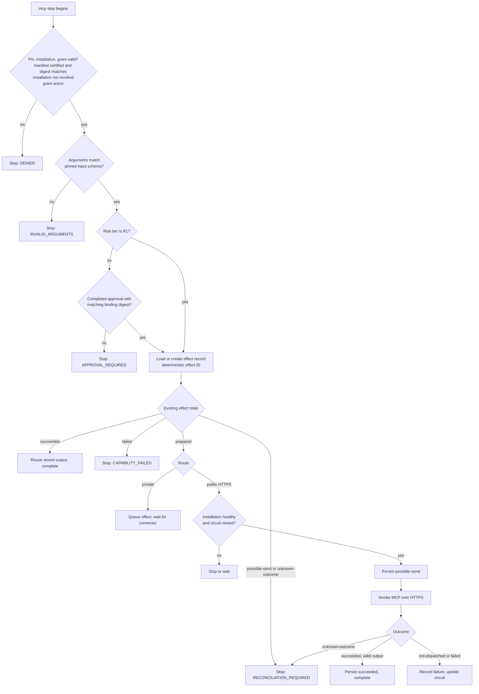

Effect states: `prepared`, `queued`, `possible-send`, `succeeded`, `unknown-outcome`, `failed`.

The gateway writes `possible-send` before it invokes the tool. If the process dies after that write, the next attempt sees `possible-send` and demands reconciliation instead of sending again. The effect ID is derived from the run ID and node ID, so a replayed step finds its own record.

### 6.6 Approvals

An approval binds to a digest of the run ID, definition digest, capability, installation, target, and arguments digest. An approval for one effect cannot authorize a different target or different arguments.

The browser receives review labels, types, digests, deadlines, and decisions. It never receives raw effect arguments.

### 6.7 Triggers

Two trigger paths start a run.

Manual start: `workflow.start` command from Studio. The server validates the input against the trigger schema.

Signed webhook: an external sender posts to `/workflow-webhook/:tenantId/:definitionId` with three headers.

| Header | Purpose |
| --- | --- |
| `x-workflow-event-id` | Unique event identity for replay detection |
| `x-workflow-timestamp` | Freshness check |
| `x-workflow-signature` | Signature over the body |

| Response | Meaning |
| --- | --- |
| 202 with `runId` and `queued` | Accepted, or a replay of an already-admitted event |
| 400 | Invalid shape |
| 403 | Bad signature, stale timestamp, or disabled credential |
| 404 | Unknown tenant or definition |

Credential handling:

- Webhook credentials are tenant-scoped records keyed by published definition ID.
- Provisioning, rotation, and disabling are administrator commands. The generated secret appears once in the response.
- Rotation keeps accepting the previous credential for five minutes.
- Before a managed record exists, ingress accepts an environment credential named `WORKFLOW_WEBHOOK_SECRET_<DEFINITIONID>`. An explicitly disabled managed record fails closed.
- Administrators can send a signed test event from Studio. The server signs it with the active credential and sends it through the same ingress path. Results return a run ID or one redacted category: `invalid-shape`, `signature`, `freshness`, `replay`, `credential-state`, `not-found`.

### 6.8 Private connector agent

For a tenant MCP server that has no public endpoint, the tenant runs `tools/workflow/private-agent.mjs` inside its network. No inbound port opens.

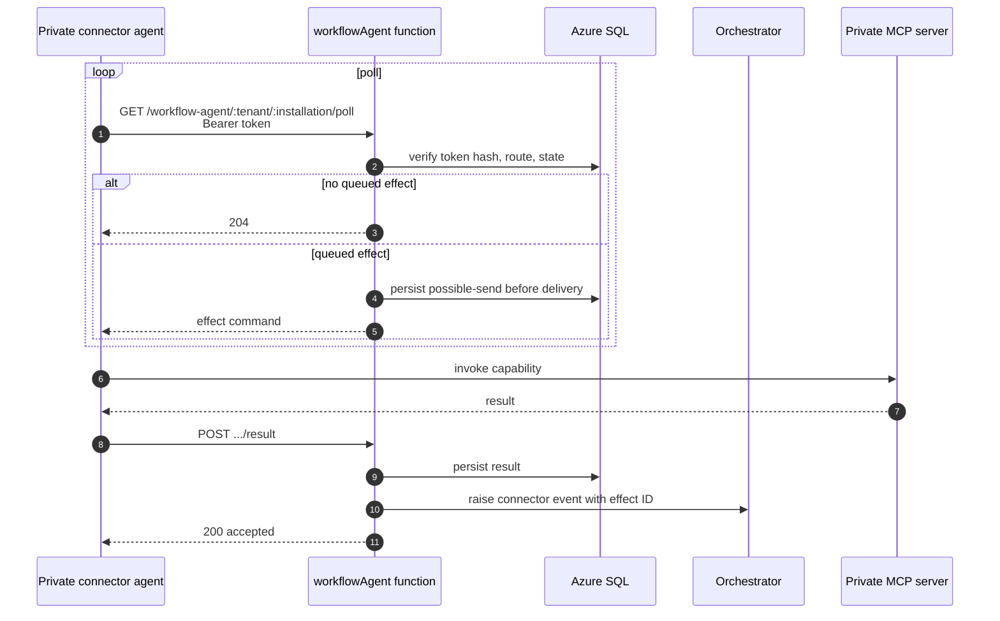

Rules:

- One revocable bearer token per installation. The admin copies it once. The server stores its SHA-256 hash and compares with a constant-time check.
- A poll marks an offline installation healthy.
- The agent resubmits a result until the platform accepts it. A repeated result with the same outcome is accepted. A different result is rejected.
- A command that may have been delivered is never polled a second time. If no result returns, the outcome is unknown and an administrator must reconcile.
- Rotating or revoking the token in Studio stops the current agent.

### 6.9 Bounded execution and the circuit breaker

Every executable node carries a policy: `milliseconds`, `attempts`, `tokens`, `cost`, `toolRounds`, `effects`. The node deadline is stored on the run before any model or capability work, so a retried step cannot extend it.

Retries apply only to failures known to happen before an external effect, such as a rejected or unavailable connection.

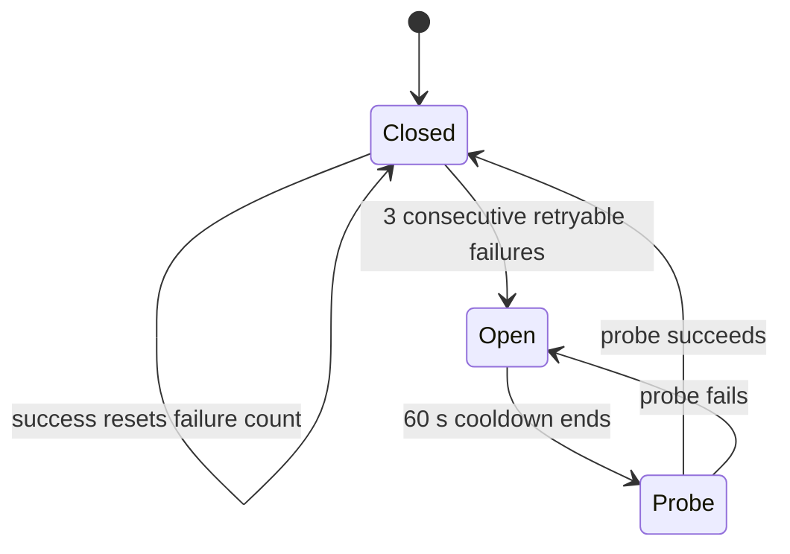

- One circuit per connector installation and one per model provider, shared within a tenant.
- While open, no new attempt dispatches. Waiting nodes move toward their deadlines with a durable timer.
- An unknown outcome never enters an automatic retry or probe path.

### 6.10 Failure and recovery policy

| Situation | Behavior |
| --- | --- |
| Connector offline | Wait durably until the node deadline. |
| Effect may have been sent, outcome unknown | Stop with `RECONCILIATION_REQUIRED`. An admin records a disposition. Nothing repeats automatically. |
| Lost connector reply | Same as above. No automatic redelivery. |
| Node failure | Stop the run. Keep history and effect receipts. An admin reviews prior effects before starting a new run. |
| Summary generation fails | Run stays completed. Retry three times, then record failure. No memory becomes visible. |
| Memory provider unavailable | Run stays completed. The memory step returns an explicit unavailable result. |

Reconciliation belongs to the workflow module. The admin's disposition changes only the unresolved effect and writes a terminal Run History transition in one SQL transaction.

## 7. Backend in detail

### 7.1 Request pipeline

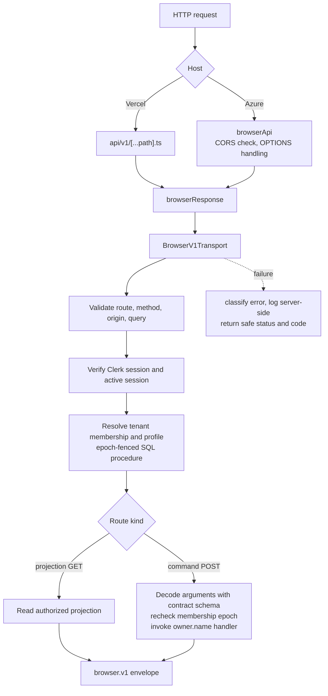

### 7.2 Transport

`BrowserV1Transport` in `packages/browser/src/index.ts` is the single choke point for browser traffic. It:

- Verifies the Clerk session token and active session. The audience must be `platform-browser-api` and the authorized party must match an exact configured origin.
- Resolves tenant membership through stored procedures that fence reads on active tenant and membership epochs.
- Validates query parameters. Page size is capped at 100. Cursors are opaque and validated.
- Decodes command bodies against a declared argument schema before invoking a handler. Handlers without a live implementation stay unavailable.
- Normalizes failures. An optional `onError` hook receives the raw error for server-side logging. Clients see only a safe status, category, and code.

Error mapping examples: `FEATURE_NOT_READY` returns 501 with the `terminal` category. Guarded paths return 400, 409, 501, or 503.

### 7.3 Azure Functions

| Function | Route | Purpose |
| --- | --- | --- |
| `browserApi` | `GET, POST, OPTIONS v1/{*path}` | Browser API, CORS for configured origins |
| `workflowWebhook` | `POST workflow-webhook/{tenantId}/{definitionId}` | Signed trigger ingress |
| `workflowAgent` | `workflow-agent/{tenantId}/{installationId}/{operation}` | Private agent poll and result |
| `workflowRun` | Orchestration | Sequential node execution |
| `workflowDispatchRecovery` | Timer, every minute | Starts pending run dispatch intents left by webhook admission |

Activities: `workflowDefinitionStart`, `workflowStep`, `workflowExpire`, `workflowSummary`, `workflowSummaryFailed`, `workflowMemoryPromote`, `workflowMemoryRemove`, `workflowMemoryCorrect`.

Auxiliary orchestrations: `workflowMemoryPromotion`, `workflowMemoryRemoval`, `workflowMemoryCorrection`. Each retries its activity three times.

### 7.4 Workflow package internals

| File | Responsibility |
| --- | --- |
| `graph.ts` | Graph draft types, validation, compilation, capability pins |
| `service.ts` | Check, publish, start, approve, grant, webhook credentials, reconciliation, installations |
| `runtime.ts` | `WorkflowWorker`: per-node execution, circuit breaker, effect handling |
| `ports.ts` | `HttpModelPort`, `HttpMcpPort`, `UpstashVectorMemoryPort` |
| `sql.ts` | `AzureSqlWorkflowStore` with tenant-keyed, version-checked records |
| `memory.ts` | Memory proposal validation, scope, fingerprints |
| `openrouter-connection.ts` | AES-256-GCM envelope for tenant OpenRouter keys |

Storage pattern: runs, effect intents, summaries, installations, grants, and circuit state are tenant-keyed SQL records with version checks. A write with a stale version fails with `STALE`, and the caller rereads. Circuit updates retry up to three times on `STALE`.

Ports are interfaces (`ModelPort`, `McpPort`, `HostedMemoryPort`), so the end-to-end test suite runs the whole workflow against in-memory implementations.

### 7.5 SQL connection handling

Azure SQL adapters share one connection-pool promise per connection string. Rejected pools are evicted. Every request still calls a tenant- and epoch-fenced procedure. Runtime reads use a role separate from the projection writer role.

## 8. API reference and routing

All browser routes live under `/api/v1`. Requests carry `Authorization: Bearer <Clerk session token>`. Tenant-scoped requests also carry `x-platform-tenant`.

### 8.1 Route map

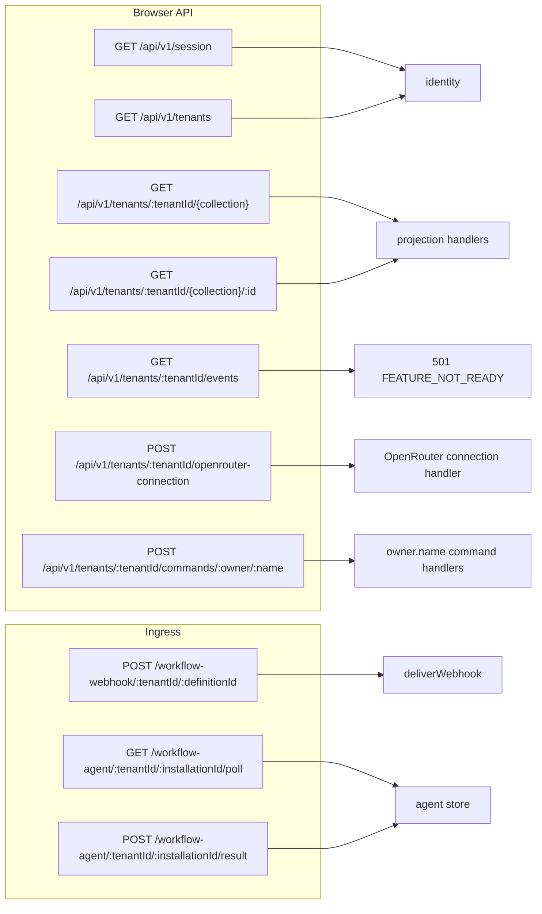

### 8.2 Session and tenants

| Method and path | Result |
| --- | --- |
| `GET /api/v1/session` | Verified session and identity |
| `GET /api/v1/tenants` | Tenant memberships for the caller |

### 8.3 Projection collections

`GET /api/v1/tenants/:tenantId/{collection}` and `.../{collection}/:id` return safe, tenant-scoped projections. Query parameters: `pageSize` (maximum 100) and `cursor`.

| Surface | Collections |
| --- | --- |
| Studio | `packages`, `agent-teams`, `workflows`, `skills`, `evaluations`, `test-runs`, `reviews`, `versions`, `improvements` |
| Catalog | `packages`, `installations` |
| Operations | `cases`, `interventions`, `capabilities`, `operations`, `memory`, `evaluations`, `improvements`, `deployments`, `readiness` |
| Technical Implementation | `readiness`, `cases`, `interventions`, `operations` |
| Vendor Risk and Access | `vendor-assessments`, `access-grants`, `cases`, `operations` |

Workflow projections used by Studio include `workflow-drafts`, definitions, run history, webhook state, and memory state.

### 8.4 Commands

`POST /api/v1/tenants/:tenantId/commands/:owner/:name`

Required headers:

| Header | Purpose |
| --- | --- |
| `Origin` | Must match an allowed browser origin |
| `Content-Type` | JSON body |
| Browser API version marker | `browser.v1` |
| `Idempotency-Key` | Safe retries, one effect per key |
| `X-Correlation-Id` | Trace linkage |
| `If-Match` | Expected version for optimistic concurrency |

The response is a receipt with revision, state, digest, and evidence IDs.

Workflow and Studio commands:

| Command | Role | Effect |
| --- | --- | --- |
| `studio.create-draft` | editor | Create a graph draft |
| `studio.save-draft` | editor | Save a draft against an expected revision |
| `workflow.check` | editor | Validate the draft, record check evidence |
| `workflow.publish` | admin | Compile and publish an immutable definition |
| `workflow.start` | operator | Start a run with typed input |
| `workflow.approve` | admin | Approve or reject one bound effect |
| `workflow.grant` | admin | Grant one capability to one node |
| `workflow.provision-webhook-credential` | admin | Create webhook credential, return secret once |
| `workflow.rotate-webhook-credential` | admin | Rotate, previous credential valid five minutes |
| `workflow.disable-webhook-credential` | admin | Fail closed for the definition |

More commands cover connector installation and enrollment, memory imports, memory correction and withdrawal, run reconciliation, and webhook tests. See `packages/browser/src/workflow-commands.ts` and `studio-commands.ts`.

### 8.5 Unified request sequence

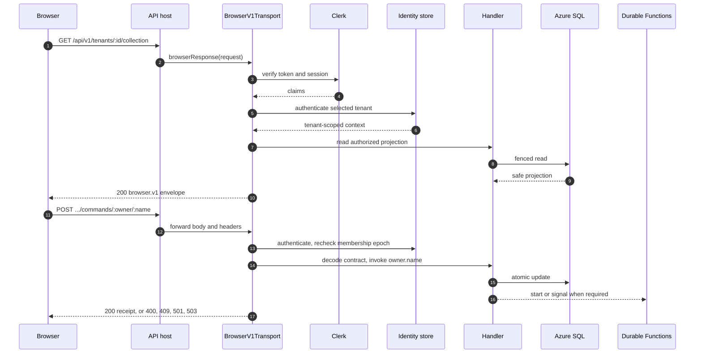

The editable diagram source is `docs/api-routes-sequence.drawio`, with a JSON description in `docs/api-routes-sequence.json`.

### 8.6 Status codes

| Code | Use |
| --- | --- |
| 200 | Projection or command receipt |
| 202 | Webhook accepted or replayed |
| 204 | Connector poll with no work, or CORS preflight accepted |
| 400 | Invalid request, or identity not resolved |
| 403 | Denied, or origin not allowed |
| 404 | Unknown route, tenant, or object |
| 409 | Stale revision or conflict |
| 501 | Feature not ready (`FEATURE_NOT_READY`) |
| 503 | Dependency unavailable |

## 9. User flows

### 9.1 Roles

Roles come from `identity.membership_profiles`, not from the browser.

| Role | Can |
| --- | --- |
| editor | Create, save, and check drafts |
| operator | Start runs, inspect history and projections |
| admin | Publish, approve, grant capabilities, manage connectors, webhook credentials, memory imports, reconciliation |

### 9.2 Author and publish

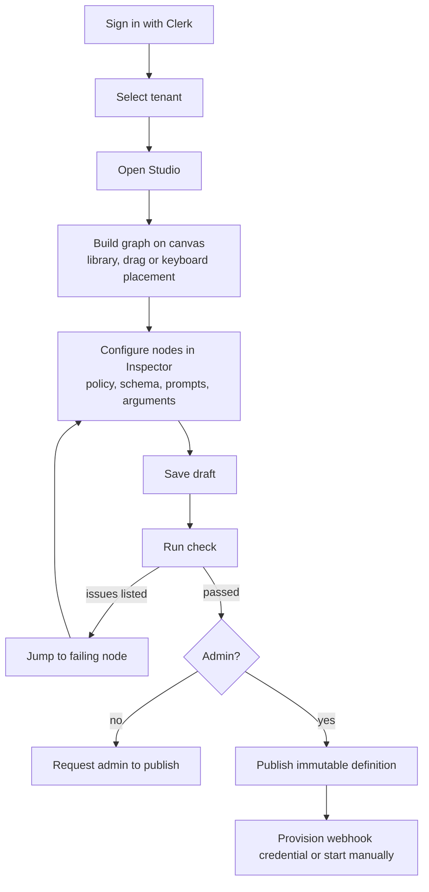

### 9.3 Connector setup

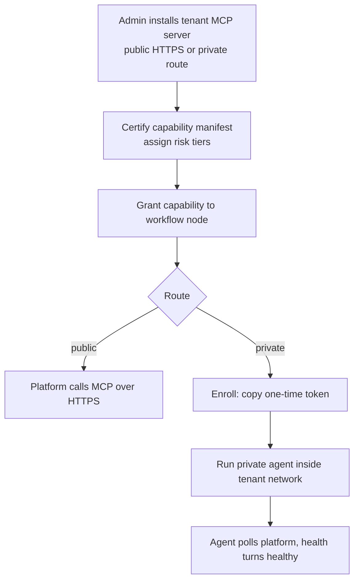

### 9.4 Run with approval

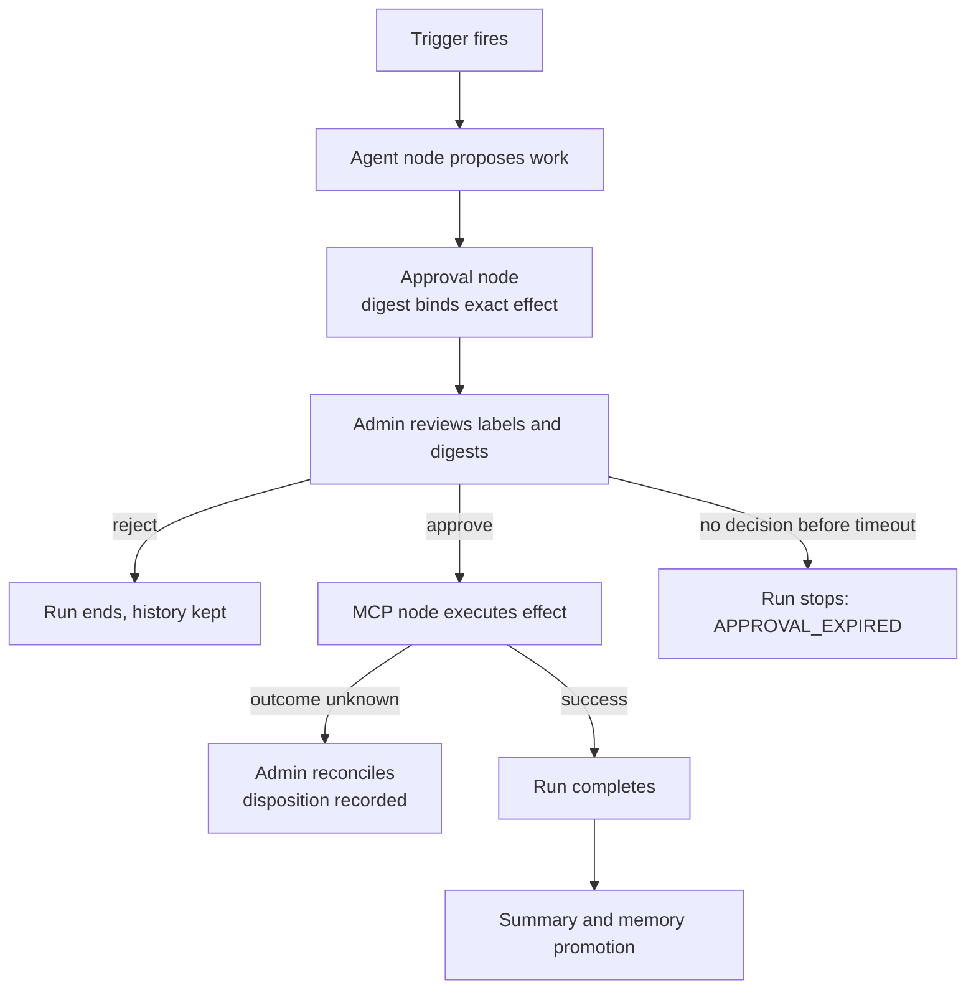

### 9.5 Inspect a run

Run History shows the pinned definition revision and digest, a redacted input summary (field names and types), chronological node events, condition branches, approval wait and expiry, receipt and argument digests, and reconciliation state. It never shows raw input values or effect arguments.

## 10. Operational memory

Operational memory lets later runs of a workflow use validated facts from earlier ones. It is separate from Run History.

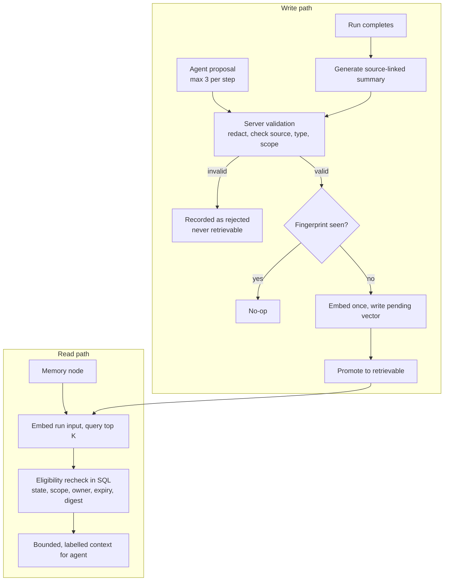

Rules:

- Admitted items are task facts supported by validated run input or events, and preferences that an identified user stated explicitly. Inferred traits, unsourced claims, secrets, and new instructions are excluded.
- Scope defaults to the tenant and the stable workflow definition ID. Items record the producing revision.
- Cross-workflow use needs an admin-published Memory Import that pins a source summary by run ID and digest. Revocation applies to future retrievals. Imports never cross tenants.
- Only a Memory node retrieves memory. Agent nodes do not retrieve it implicitly.
- Models are chosen explicitly, never by environment default. Each Agent step names its provider and exact model. A tenant administrator names the summary model (with an optional fallback) and the embedding model in Studio, saved as Model settings. OpenRouter choices come from the live OpenRouter catalog (chat and embeddings), and structured output is checked against it. There is no environment allowlist.
- Embeddings default to the Upstash index's built-in model. A tenant can instead use OpenRouter or Azure OpenAI embeddings whose vectors match the index dimension; a test call verifies this on save. Each vector is tagged with its embedding profile and queries filter to the current profile, so vectors from different models never mix. There is no cross-provider embedding fallback.
- Upstash Vector is server-only: one namespace per tenant, deterministic item IDs, server-derived metadata filters, bounded `topK`, and a final SQL eligibility recheck. Azure SQL keeps lifecycle and audit metadata, never memory text or embeddings.
- Withdrawal, deletion, source invalidation, and correction change the SQL eligibility ledger before vector cleanup, so a stale vector match cannot be recalled.
- Items expire after 90 days by default. Admins can shorten expiry, never extend it.
- The tenant allowlist is disabled by default. A failed provider leaves the run complete and returns an explicit unavailable result.

## 11. Security model

| Control | Implementation |
| --- | --- |
| Authentication | Clerk session token verified on every request, with audience and authorized-party checks |
| Authorization | Tenant and membership epoch fencing in SQL procedures. Role checks in owner procedures. The browser never supplies a role. |
| Tenant isolation | Tenant-keyed records. Vector namespace per tenant. Provider circuits scoped to tenant. |
| Capability authority | Certified manifest, manifest digest pin, explicit grant, risk tier, approval. Enforced by the gateway, not by the prompt. |
| Approval binding | Digest over run, definition, capability, installation, target, and arguments |
| Idempotency | Idempotency keys on commands. Deterministic effect IDs. Fingerprints for memory. |
| Secrets | Server-only environment variables. OpenRouter keys stored in a tenant-bound AES-256-GCM envelope authenticated with tenant ID, provider, and wrapping-key version. |
| Connector tokens | SHA-256 hash stored, constant-time comparison, single-use display, manual rotation |
| Webhooks | Signature, freshness window, replay detection, rotation grace period, fail-closed disable |
| Untrusted content | Model output validated against schema. Memory labelled as untrusted evidence. |
| Error hygiene | Stack traces, SQL errors, and provider details stay on the server |
| HTTP headers | `X-Content-Type-Options`, `Referrer-Policy`, `Permissions-Policy` set in `vercel.json` |
| Telemetry | URL query strings stripped. SQL parameter values never attached. |

## 12. Data model and migrations

Migrations live in `database/migrations`. Each has a matching verification script in `database/verify`.

| Migration | Adds |
| --- | --- |
| `001_identity_tenant_access` | Users, tenants, memberships, epochs |
| `002_browser_read_models` | Expiring collection snapshots, read procedures |
| `003_solution_studio` | Studio drafts, revisions, evidence |
| `004_connected_platform` | Connected platform tables |
| `005_diagram_workflow_v1` | Workflow definitions, runs, effects, installations, grants, circuit state |
| `006_agentic_memory_v1` | Memory items, imports, retrieval ledger |
| `007_webhook_admission_and_history` | Webhook admission, run history |
| `008_openrouter_tenant_connection` | Encrypted tenant OpenRouter connection |
| `009_bounded_run_history` | Forward-only keyset paging over `(created_at, id)` |

Entity diagrams for identity are in `database/erd/`.

```sh
pnpm sql:migrate
pnpm sql:verify
pnpm sql:status
pnpm sql:seed:demo
```

Run History pages use a keyset cursor. The cursor is navigation state, not authority.

## 13. Frontend

The browser shell in `apps/browser` is a React 19 and Vite 7 app.

| Area | Files |
| --- | --- |
| Public pages | `landing.tsx`, `sign-in.tsx` |
| Shell and routing | `app.tsx`, `platform-app.tsx`, `platform-routes.ts`, `app-routes.ts` |
| API client | `platform-api.ts`, `session-state.ts` |
| Studio | `studio-editor.tsx`, `inspector.tsx`, `workflow-model.ts` |
| Panels | `connector-panel.tsx`, `webhook-panel.tsx`, `run-history.tsx`, `workflow-memory-panel.tsx`, `memory-import-panel.tsx`, `openrouter-connection-panel.tsx` |
| Governance preview | `governance-preview.tsx` |

Behaviors worth knowing:

- Clerk tokens stay in Clerk-managed memory and travel only as Bearer headers.
- The Studio canvas supports pointer and keyboard placement, arrow-key movement, selectable edges, bounded zoom, and a phone layout driven by CSS.
- Draft state is explicit (`loading`, `ready`, `failed`), so a failed load never looks like an empty draft.
- One `pending` union prevents two commands from showing the same label. Destructive canvas changes go through one confirmation dialog.
- Fixture-only surfaces show a "Local example, not saved or evaluated" notice.
- Client routing rewrites all non-`/api/` paths to `index.html`.

## 14. Observability and error handling

### 14.1 Tracing

- `azure-functions/src/telemetry.ts` loads before any function module.
- Traces export to Application Insights only when `APPLICATIONINSIGHTS_CONNECTION_STRING` is set.
- SQL (tedious) and outbound HTTP (undici) calls produce spans.
- Each `workflowStep` activity produces one `workflow.step` span with tenant, run, and node IDs. Failed nodes record the exception on the server. Spans are created only in activities, never in replayed orchestration code.

### 14.2 Errors

- `packages/errors` provides `AppError`, classification, a boundary wrapper for functions, and reporting.
- Handlers wrap in `withErrorBoundary`. Activities wrap in a `logged` helper that reports with site, tenant, and correlation ID.
- Clients receive a category and code, never internals.

### 14.3 Profiling

```sh
pnpm profile:workflow
```

Writes V8 CPU profiles of the end-to-end workflow scenario to `outputs/profiles/`. The scenario uses in-memory ports, so it measures orchestration CPU only. Waits on SQL, models, MCP servers, and Upstash appear in traces.

## 15. Local development

### 15.1 Prerequisites

- Node.js 22.14.0
- pnpm 10.15.1 through Corepack
- A Clerk application
- Optional: Azure SQL database, Azure Functions Core Tools, Upstash Vector, OpenRouter key

### 15.2 Setup

```sh
corepack enable
pnpm install
cp apps/browser/.env.server.example apps/browser/.env.server.local
pnpm --dir apps/browser --ignore-workspace dev
```

Set `VITE_CLERK_PUBLISHABLE_KEY` for the browser and `VITE_PLATFORM_API_ORIGIN` when the API runs elsewhere.

### 15.3 Fixture mode and SQL mode

| Mode | Trigger | Identity source |
| --- | --- | --- |
| Fixture | `AZURE_SQL_CONNECTION_STRING` unset | `PLATFORM_LOCAL_CLERK_SUBJECT` and `PLATFORM_LOCAL_TENANTS`. Data is labelled and ephemeral. |
| SQL | `AZURE_SQL_CONNECTION_STRING` set | `identity.users` row matching the Clerk issuer and subject, a current membership in an active tenant, and `identity.membership_profiles` rows. Local fixture settings are ignored. |

An unmapped Clerk user gets a 400 and Studio shows "Service unavailable". Run migrations and verification first.

### 15.4 Private connector agent

```sh
WORKFLOW_AGENT_BASE_URL=https://your-function-app.azurewebsites.net \
WORKFLOW_AGENT_TENANT_ID=your-tenant-uuid \
WORKFLOW_AGENT_INSTALLATION_ID=your-installation-uuid \
WORKFLOW_AGENT_TOKEN=the-enrollment-token \
WORKFLOW_AGENT_MCP_URL=http://127.0.0.1:3000/mcp \
node tools/workflow/private-agent.mjs
```

Set `WORKFLOW_AGENT_MCP_TOKEN` when the MCP endpoint needs a bearer token.

### 15.5 Scripts

| Script | Purpose |
| --- | --- |
| `pnpm verify` | Workspace check, contracts, lint, typecheck, tests, evidence |
| `pnpm lint` | ESLint |
| `pnpm typecheck` | TypeScript project check |
| `pnpm test` | Vitest |
| `pnpm contracts` | Build contracts and run governance checks |
| `pnpm build:showcase` | Build the browser app |
| `pnpm build:azure` | Compile Azure Functions |
| `pnpm certify:upstash` | Certify the Upstash Vector integration |
| `pnpm profile:workflow` | CPU profile of the workflow scenario |
| `pnpm sql:migrate`, `sql:verify`, `sql:status`, `sql:seed:demo` | Azure SQL tooling |

## 16. Configuration reference

| Variable | Used by | Purpose |
| --- | --- | --- |
| `CLERK_ISSUER` | API | Expected token issuer |
| `CLERK_PUBLISHABLE_KEY` | API | Clerk publishable key |
| `CLERK_SECRET_KEY` | API | Clerk secret key, server only |
| `CLERK_AUDIENCE` | API | Must be `platform-browser-api`. Add `{ "aud": "platform-browser-api" }` to the Clerk session token claims. |
| `CLERK_AUTHORIZED_PARTIES` | API | Exact comma-separated browser origins, also drives CORS |
| `VITE_CLERK_PUBLISHABLE_KEY` | Browser | Clerk publishable key |
| `VITE_PLATFORM_API_ORIGIN` | Browser | API origin when separate |
| `AZURE_SQL_CONNECTION_STRING` | API, Functions | Enables SQL mode |
| `PLATFORM_LOCAL_CLERK_SUBJECT`, `PLATFORM_LOCAL_TENANTS` | Local API | Fixture mode access |
| `WORKFLOW_OPENROUTER_WRAPPING_KEY_VERSION` | API, Functions | Wrapping key version, for example `v1` |
| `WORKFLOW_OPENROUTER_WRAPPING_KEY` | API, Functions | 32-byte base64url key |
| `WORKFLOW_OPENROUTER_MAX_COST_PER_1K_TOKENS` | API, Functions | Cost rate used only when OpenRouter reports no per-request cost |
| `WORKFLOW_MAX_COST_PER_1K_TOKENS` | Functions | Cost rate for Azure OpenAI calls |
| `UPSTASH_VECTOR_REST_URL` | API, Functions | Upstash Vector REST endpoint |
| `UPSTASH_VECTOR_REST_TOKEN` | API, Functions | Upstash Vector write token |
| `UPSTASH_VECTOR_DIMENSION` | API, Functions | Index dimension, default `384`; external embeddings must match it |
| `WORKFLOW_MEMORY_ENABLED_TENANTS` | API, Functions | Comma-separated tenant IDs allowed to use Operational Memory |
| `WORKFLOW_WEBHOOK_SECRET_<DEFINITIONID>` | Functions | Fallback webhook secret before a managed credential exists |
| `APPLICATIONINSIGHTS_CONNECTION_STRING` | Functions | Enables trace export |

Never commit `.env.local`, `.env.server.local`, or any file holding real keys. Rotate a key that has appeared in a committed or shared file.

## 17. Testing and verification

`pnpm verify` runs, in order: workspace check, contracts, lint, typecheck, tests. It also builds workspace evidence.

Test layers:

- Unit tests sit next to source files.
- `packages/workflow/src/workflow-e2e.test.ts` drives complete runs through the worker with in-memory ports, covering approvals, connector polling, circuits, reconciliation, memory, and summaries.
- `packages/browser` tests cover contracts, transport, commands, projections, and the local host.
- Browser app tests cover routes, API client, session state, and the workflow model.

Fixture evidence does not prove live cloud or provider operation. Live checks need configured credentials for every agent provider.

## 18. Deployment

| Target | Contents | Configuration |
| --- | --- | --- |
| Vercel | Static Vite build from `apps/browser/dist`, plus `api/v1/[...path].ts` | `vercel.json` sets the build and install commands, SPA rewrite, and security headers |
| Azure Functions | Browser API, webhook ingress, agent ingress, durable orchestrations | `host.json` enables OpenTelemetry mode. Build with `pnpm build:azure`. Entry: `dist/azure-functions/src/index.js` |
| Azure SQL | Identity, projections, workflow store | Apply migrations with `pnpm sql:migrate` |
| Infrastructure | Bicep templates | `infra/` |

## 19. Further reading

- [Architecture](docs/architecture.md)
- [Architecture decision records](docs/adr/)
- [Diagram workflow V1 decisions](docs/diagram-workflow-v1-decisions.md)
- [Browser setup](apps/browser/README.md)
- [Private agent and profiling](tools/workflow/README.md)
- [Domain glossary](CONTEXT.md)
- [Studio coverage](docs/portfolio/solution-studio-coverage.md)
